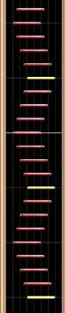
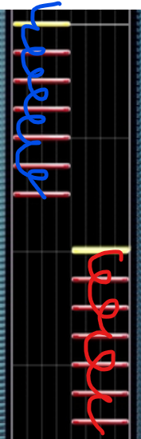
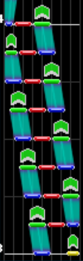
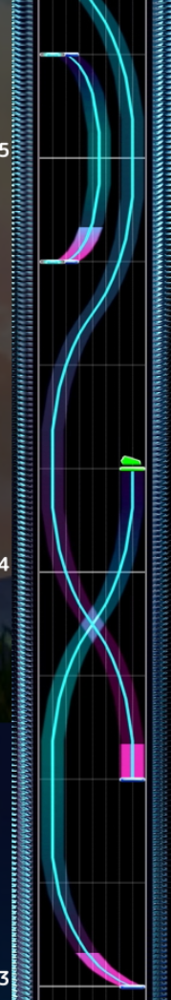
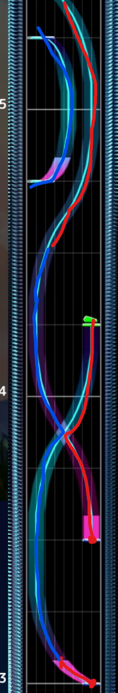
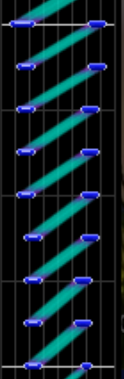
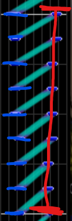
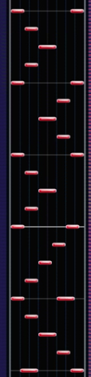
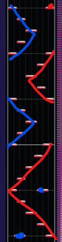

# "Cheating"

Chunithm can be quite difficult, but because of the input mechanism of the ground slider, you can actually make certain patterns much easier. Do note that I do not generally condone the below techniques and **recommend you learn how to hit patterns properly**, but they're quite powerful in the right circumstances.

## Washa-Washa on Tap Trains

You can actually washi-washi on tap trains that **aren't as narrow** apart as the above example and still maintain justice. This occurs because the game kindly cuts off the attack/miss timing window if there is a tap note that directly follows another one, you can check out [this video](https://www.youtube.com/watch?v=HViDhH2BtNY&t=71s) to learn more (Japanese only). This is generally easier than tateren.

However, do note that you will likely not hit within the Justice Critical window if you do this strategy. This technique does **NOT** work well with chords, and you will have to hit overlapping notes with chords legitimately.

{: style="width: 100px"}{: style="width: 100px"}{: style="width: 100px"}
 
Appears in: *ＧＯ！ＧＯ！ラブリズム♥*, *Grevious Lady, Black Lotus*, etc.

## Flick Tech

There are a lot of ways to tech flicks. The primary relevant tech involving flicks is edge tech, where if you tap the very edge column for a flick that touches the edge of the play field, it will trigger it. One way to make this more consistent is to place your hand on the area of the slider that is just outside the sensor zone, and tapping there will usually trigger the edge flick.

There are some other techniques that you can also find in [this video](https://www.youtube.com/watch?v=dvtSCHlILbU&t=1s) (Japanese only).

## Fake Holds

Remember how I mentioned that all holds have ticks within them to check for input? That's not actually the case if the hold or slide note is really really short, and the ending tick is also removed if the end of a hold/slide is an air note. The consequence of this is that the only input required is the very beginning, and fake holds are functionally tap-air notes in disguise.

{: style="width: 100px"}≅{: style="width: 100px"}
 
Appears in: *頓珍漢の宴*, etc.

## Slide Transfers

A lot of the time in Chunithm it is easier to transfer slides between hands instead of crosshanding, which allows you to keep your hands on their respective sides of the slider and more capable to hit oncoming patterns. As long as you keep some input on the slide without lifting your hand, it should be fairly easy to transfer them between hands. Another method of taking advantage of slide properties is that slides that move from one side to another but end in the same place can be simplified: hold one hand down on the end of the slide and tap the start with the other hand.

{: style="width: 100px"}{: style="width: 100px"}{: style="width: 100px"}{: style="width: 100px"}
 
Example: *Arcahv*, *GOODTEK*.

## Sliding Tap Notes

Instead of keyboarding difficult patterns like 5k or other types, you can just treat everything like a tap slide. The Japanese high ranker Ave New is somewhat (in)famous for having an extremely slide-y playstyle, but he is proof it is possible to get very good playing the game your way.

{: style="width: 100px"}{: style="width: 100px"}
 
Example: *蜘蛛の糸*.
