# Advanced Patterns

Here you will find a set of patterns that tend to show up mainly in Expert to Master level charts, and while not very common, are good to know for descriptive or analytical purposes.

## Helix/DNA Pattern

This pattern surfaced in *Xevel*, and features a trill that crosses over itself and back. The intended way to hit the pattern is to **crossover** with your hands while maintaining the trill rhythm, but it is **extremely difficult** to hit consistently without a lot of practice.

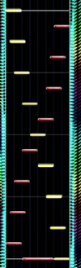{: style="width: 100px"}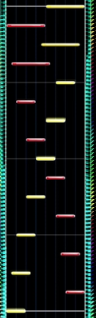{: style="width: 100px"}

There is a method to simplify the helix pattern, which is to tap two notes in the middle part of the trill with the same hand instead of alternating, which allows you to avoid crossing over (shown below).

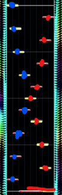{: style="width: 100px"}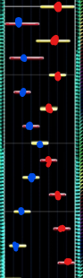{: style="width: 100px"}
 
Appears in: *Xevel*, *Calamity Fortune*, *Megameteor*, *X7124*, etc.

## Cyaegha Pattern

Also referred to as "bon odori" (盆踊り), this pattern is very prominent in the chorus of *Cyaegha*, although it shows up in simpler and more complex forms in many other charts. It consists of alternating edge notes, one of which has an air, and a center note.

The intended method to play this pattern is to alternate which hand goes up in the air and which hand hits the middle ground note in kind of a side to side seesaw motion. However, since airs are agnostic of horizontal position, you can just use the same hand over and over again to hit the air notes and treat the rest of the pattern like a standard trill. Some variations are shown on the right.

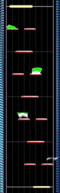{: style="width: 100px"}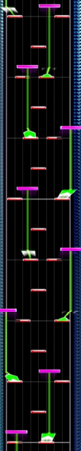{: style="width: 100px"}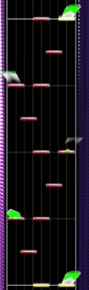{: style="width: 100px"}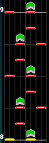{: style="width: 100px"}
 
_The first two images are functionally the exact same pattern, even if the last two images look more complex_.
 
Appears in: *Cyaegha*, *患部で止まってすぐ溶ける～狂気の優曇華院 (Overdrive)*, *ADAM*, *Oshama Scramble (Cranky Remix)*, *Xevel \[EXP\]*, *ウミユリ海底譚*, etc.

## USAO Pattern/Air Circles

The USAO pattern is composed of repeating flick \+ air notes in a row, and it is intended to be hit by "drawing air circles" with the hand hitting them while the other hand usually has other notes to hit. I call it this because almost every single USAO chart in the game has this pattern. This is a somewhat more stamina-intensive pattern, but you can easily focus on the other ground patterns once you realize you just repeat the same motion.

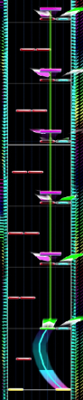{: style="width: 100px"}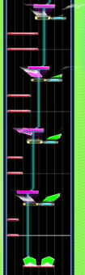{: style="width: 100px"}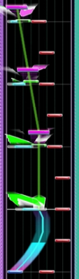{: style="width: 100px"}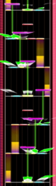{: style="width: 100px"}
 
Appears in: *Climax*, *BLUE ZONE*, *ADAM*, *Caliburne \~Story of the Legendary Sword\~*, *Excalibur \~Revised Resolution\~*, *JIGOKU STATION CENTRAL GATE*, *Knight Rider*, *Cyaegha*, etc.

## Full Sweep

A pattern that features you sweeping both hands from one side of the slider to the other, with the outer hand being pushed into the air. Generally alternates fairly quickly.

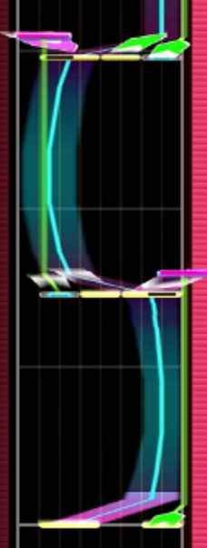{: style="width: 100px"}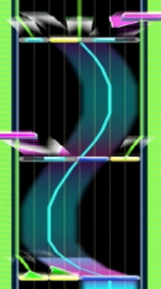{: style="width: 100px"}
 
Appears in: *Zest of Blue*, *うまぴょい伝説*, etc.

## Blackmagik Pattern

The Blackmagik pattern is essentially a chord trill except **every note is an air note**. The way to hit this pattern is to quickly raise your hand into the air and repeatedly bounce up and down on the rhythm. This pattern is highly stamina-draining and hard to hit at high speed.

Because of how lenient the air judgement window is, one strategy involves **only lifting one hand** to save stamina.

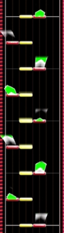{: style="width: 100px"}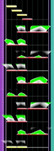{: style="width: 100px"}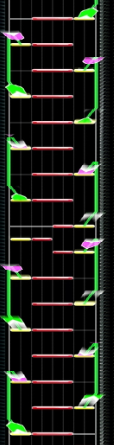{: style="width: 100px"}
 
_This goes on for four measures. Everlasting Liberty even mixes in a chord triplet_.
 
Appears in: *Blackmagik Blazing*, *eden*, *Everlasting Liberty*.

!!! mitsuyoshi "Mitsuyoshi Tip!"
    <strong id="mitsuyoshi-9">"Halving" air patterns</strong>

    Because air timing windows are highly lenient, you can simplify similar patterns by only using a single hand to move up into the air and treating every other air input as a down air.

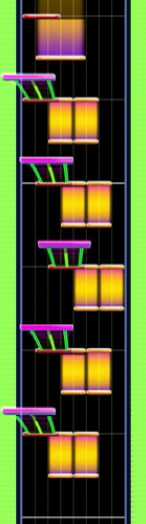{: style="width: 100px"}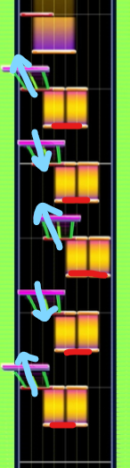{: style="width: 100px"}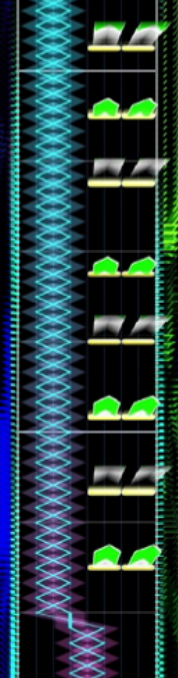{: style="width: 100px"}{: style="width: 100px"}
 
Appears in: *竹*, *宛城、炎上！！*

## Imperishable Night Pattern

A pattern that is prominent in Imperishable Night 2006 (2016 Refine). It is essentially an alternating 4k stream with alternating jumps. It is not extremely complicated on its own, but charts will slowly move notes left and right to shift the positioning of the pattern, on top of it being a 16th note pattern around 160 bpm.

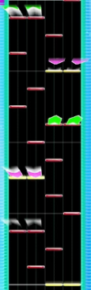{: style="width: 100px"}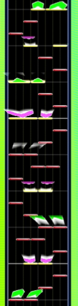{: style="width: 100px"}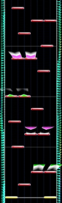{: style="width: 100px"}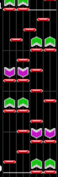{: style="width: 100px"}
 
*The pattern takes up like 20% of the Imperishable Night chart*.
 
Appears in: *Imperishable Night 2006 (2016 Refine)*, *初音天地開闢神話*, *Hainuwele*, *Blazing AIR*.

## Notes Overlapping Holds

There are many patterns where there will be a hold note, and then tap notes have to be hit on top of those hold notes. This is even the primary gimmick of some tech charts, such as *Yume no hajimari* (where the entire chart is played on top of a hold). Essentially, you need to choose one of your fingers to maintain the hold or slide and use your remaining fingers to hit the patterns, but there is a ton of variation for how this can be charted.

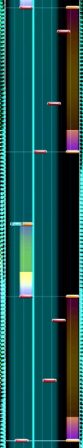{: style="width: 100px"}{: style="width: 100px"}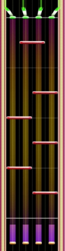{: style="width: 100px"}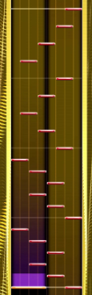{: style="width: 100px"}
 
Appears in: *Yume no hajimari*, *GEMINI -C-*, *今ぞ♡崇め奉れ☆オマエらよ！！ ～姫の秘メタル渇望～*, *HAELEQUIN (Original Remaster)*, etc.

## Jumps over Middle Trill

Did you think split trills were hard? Try maintaining trill control while jumping above it with the other hand. The intended strategy is to trill the middle two notes with one hand (usually the right hand) and jump to the left and right with the other. There are ways to tech this kind of pattern by splitting it in the middle and forcing a very fast anmitsu with airs, but your mileage may vary.

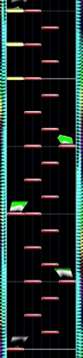{: style="width: 100px"}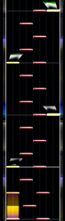{: style="width: 100px"}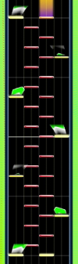{: style="width: 100px"}
 
Appears in: *Xevel*, *Blazing;Storm*, *脳天直撃*.

## Flick Slide under (Middle) Jumps

This pattern requires you to dedicate one hand to hitting jumps in the middle while the other slides back and forth (quickly) on the ground slider. This pattern is very tricky at first, and it is easy to mess up which hand is responsible for what.

A variation on this pattern is in インビジブル , ガチ恋ラビリンス, and Surveiller et punir, where you slide under with one hand but then hit notes on the return to the original side and alternate which hand is sliding/jumping.

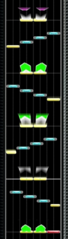{: style="width: 100px"}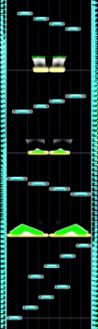{: style="width: 100px"}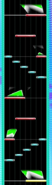{: style="width: 100px"}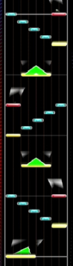{: style="width: 100px"}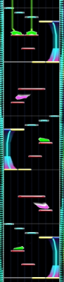{: style="width: 100px"}
 
Appears in: *IMPACT*, *TiamaT:F minor*, *インビジブル*, *ガチ恋ラビリンス*, *Surveiller et punir.*

## Tap Trains/Flick Trains and Washa-Washa

Sometimes tap notes are too close to each other to even consider trying to tateren, so what gives? Here's where we get into some deeper chunithm tech.

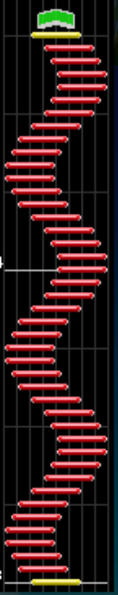{: style="width: 100px"}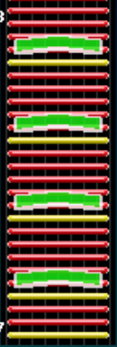{: style="width: 100px"}
 
*Chart: 害虫 - lmao*

The ground slider accepts inputs as long as it detects a change in signal across one of the individual cells in **any direction**. As such, there are two ways to hit tap trains and flick trains that are too fast otherwise: rapidly "scratch" the ground slider back and forth, or rapidly spinning your fingers in a circle on the ground slider. The Japanese term for the second technique is called "washa-washa".

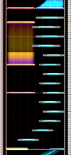{: style="width: 100px"}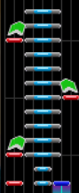{: style="width: 100px"}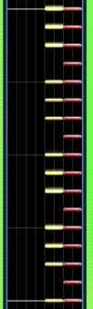{: style="width: 100px"}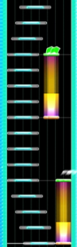{: style="width: 100px"}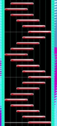{: style="width: 100px"}
 
Appears in: *殺人レコード恐怖のメロディ*, 分からない, *HERA*, *神威*, etc.

## Rubbing Thin Slides

Some charts (especially earlier ones) have blue slide notes that are very thin (e.g. Bad Apple\!\! feat.nomico, スカイクラッドの観測者, Singularity), or blue slides that start at a small point and diverge outwards (e.g. のぼれ！すすめ！高い塔).

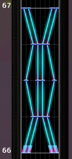{: style="width: 100px"}{: style="width: 100px"}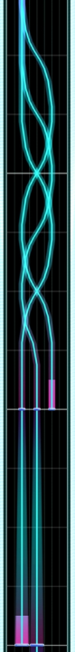{: style="width: 100px"}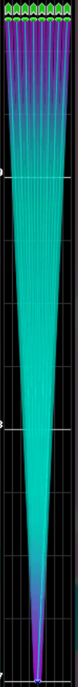{: style="width: 100px"}
 
Appears in: *Bad Apple\!\! feat.nomico*, *スカイクラッドの観測者, Singularity, のぼれ！すすめ！高い塔* , etc.

The way to increase consistency on these is to either rub **up and down** on the slider as you trace horizontally, or draw **small circles** while tracking the slide note. This will retrigger inputs on the slider and the game should not drop the slide. A few examples can be seen in [this video](https://youtu.be/_Fre-tuCz8c?si=y34Zwceb2uJt5-xo&t=107) and [this video](https://youtu.be/nBzAfVJ9U6A?si=-W1lbbECnJ7XFbfK&t=15).

It is worth noting that rubbing the entire slider up and down with no regard for the position of the slide will not work. [This twitter video](https://x.com/cnt027/status/1868662441040826581?s=46&t=9u5qVv8Pr7BKTAVNEEx14A) by player ちなつさん demonstrates why it is important to follow the position of the slide while attempting to retrigger.
