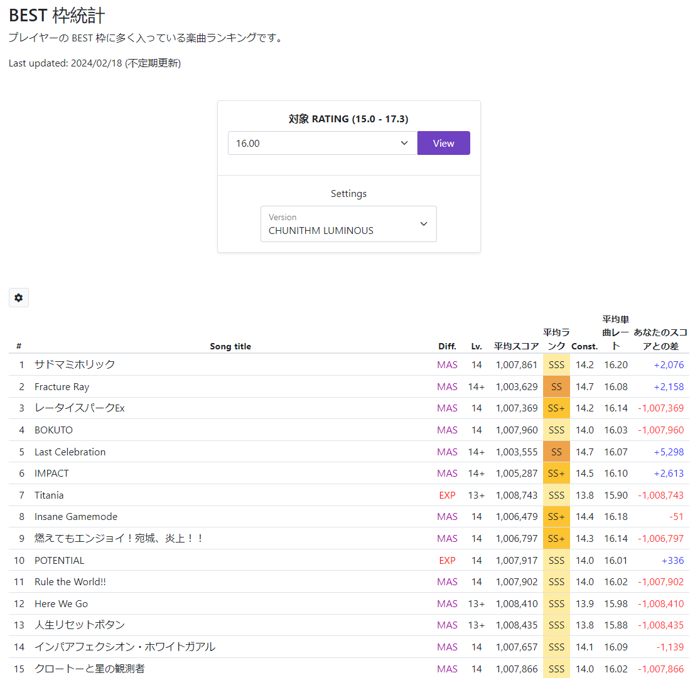
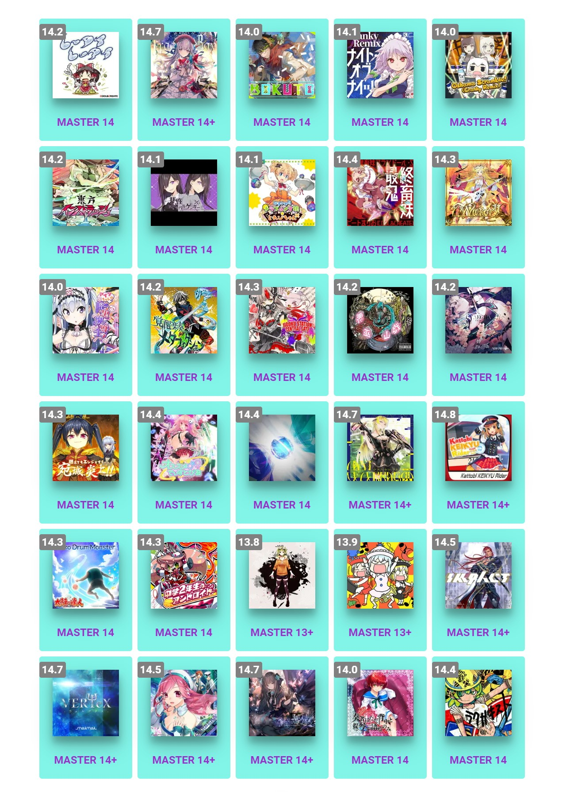
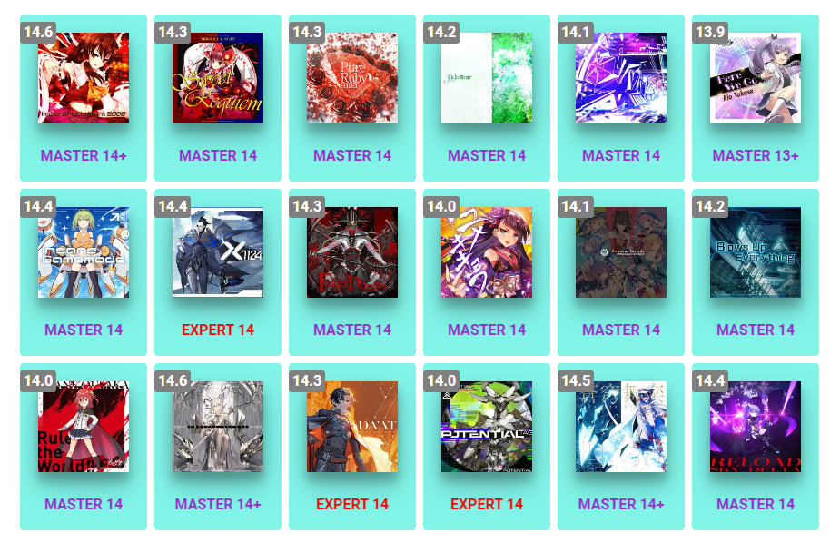

# Recommended Charts

## Codex Quick Farming Guide / Questline Task Charts

As this resource has matured, the [**Quick Farming Guide**](https://docs.google.com/spreadsheets/d/1xP1huTSA-XWKZaDfmyNh-viRbUE777d2Rg54j5-2VAU/edit?gid=1862648347#gid=1862648347) in the [Chunithm Chart Codex](https://docs.google.com/spreadsheets/d/1xP1huTSA-XWKZaDfmyNh-viRbUE777d2Rg54j5-2VAU/edit?gid=86796591#gid=86796591) has become the most up-to-date set of recommended charts for rating grind across a broad range of difficulties. The Codex contains all of the charts in the game sorted by level, accompanied by some quick notes so someone reading through it can understand and prepare for some of the main gimmicks in the chart. It contains my personal opinions on charts, as well as some opinions from other Chunithm players. If you feel strongly about a particular chart, feel free to leave a comment on the chart in question!

On the other hand, I will point to the Task Charts in the [**Kamaitachi Chunithm Questline Tracker**](https://chunithm.org/quests) for a series of challenging charts that will help players develop a more rounded skillset. These are also recommended by me, although in a different sense than the farming charts above.

## Chunirec BEST 枠統計 (Best Frame Statistics)

[Chunirec](https://chunirec.net/) is an online service that sources player data from the official JP chunithm-net and can scrape player scores for those signed up for the service.

One of their particularly useful tools is the "[**BEST 枠統計**](https://chunirec.net/stat/best?rc=160&region=jp2)" (EN: BEST Frame Statistics). This tool allows users to specify a **target rating** (ranging from 15.0 to 17.6 in increments of 0.1) and the website will display a list of the charts that are the **most common** among players who have achieved that rating alongside additional details like chart constant and the average score/rank. This service is great as you can use it to determine charts to target as you progress and gain rating from gold to high rainbow.

Note: as this is a JP tool, charts now reflect VERSE constants.

Additionally, if you have registered for a chunirec account, the difference between your obtained scores and the average score will be displayed.

Note that the list will be populated with charts up to the current official version in JP (currently chunithm LUMINOUS).

## SEGA Top 30 (**NEW**)

In the official [SEGA broadcast announcing Chunithm **NEW+**](https://www.youtube.com/watch?v=mYRvHjgA69I&t=1200s), the dev team released a list of 30 charts that were the most commonly played charts across all players that were in their best 30 when they hit rainbow. Most of the charts in this list are very common recommendations for players looking to hit the rainbow rating threshold, although I would personally not recommend some of them (_e.g. Kattobi KEIKYU Rider, VERTeX_). In order from most used to least used, those charts are:

| Rank   | Name                                                                                    | Category       | Constant (PARADISE LOST) | Constant (SUN+) |
| ------ | :-------------------------------------------------------------------------------------- | :------------- | :----------------------- | :-------------- |
| **1**  | サドマミホリック _EN: Sadomami Holic_                                                   | Touhou Project | 13.2                     | 14.2            |
| **2**  | Fracture Ray                                                                            | Variety        | 13.7                     | 14.7            |
| **3**  | BOKUTO                                                                                  | Original       | 13                       | 14              |
| **4**  | ナイト・オブ・ナイツ (Cranky Remix) _EN: Night of Knights_                              | Touhou Project | 13.1                     | 14.1            |
| **5**  | Oshama Scramble! (Cranky Remix)                                                         | Gekimai        | 13                       | 14.0            |
| **6**  | レータイスパーク Ex _EN: Rettai Spark Ex_                                               | Touhou Project | 13.3                     | 14.2            |
| **7**  | 拝啓ドッペルゲンガー _EN: Dear Doppelganger_                                            | niconico       | 13.1                     | 14.1            |
| **8**  | おまかせ！！トラブルメイ娘 ☆ とれびちゃん*EN: Omakase! Troublemaker Musume☆Torebi-chan* | Original       | 13.1                     | 14.1            |
| **9**  | 最終鬼畜妹フランドール・S _EN: Final Devil Sister Flandre S_                            | Touhou Project | 13.4                     | 14.4            |
| **10** | Warcry                                                                                  | Original       | 13.1                     | 14.3            |
| **11** | アイリちゃんは暗黒魔導士! _EN: Airi is a dark mage!_                                    | Original       | 13.1                     | 14              |
| **12** | 覚醒楽奏メタフィクション _EN: Kakusei Gakuso Metafiction_                               | Original       | 13.3                     | 14.2            |
| **13** | JIGOKU STATION CENTRAL GATE                                                             | Original       | 13.3                     | 14.3            |
| **14** | 害虫 _EN: Gaichu_                                                                       | niconico       | 13.2                     | 14.2            |
| **15** | Cyaegha                                                                                 | Variety        | 13.5                     | 14.2            |
| **16** | 燃えてもエンジョイ！宛城、炎上！！ _EN: Moetemo Enjoi! Atsushiro, Enjou!_               | Irodorimidori  | 13.3                     | 14.3            |
| **17** | オススメ ☆♂♀☆ でぃすとぴあ _EN: Osusume ☆ Danshi ☆ Onna ☆ Dystopia_                     | Original       | 13.4                     | 14.4            |
| **18** | Like the Wind \[Reborn\]                                                                | Gekimai        | 13.5                     | 14.4            |
| **19** | Last Celebration                                                                        | Original       | 13.7                     | 14.7            |
| **20** | Kattobi KEIKYU Rider                                                                    | Original       | 13.8                     | 14.8            |
| **21** | Taiko Drum Monster                                                                      | Variety        | 13.3                     | 14.3            |
| **22** | 中学 2 年生のアンドロイド _EN: Chuugaku 2-nensei no Android_                            | Original       | 13.4                     | 14.3            |
| **23** | 人生リセットボタン _EN: Life Reset Button_                                              | niconico       | 12.8                     | 13.8            |
| **24** | 疾走あんさんぶる _EN: Shissou Ensemble_                                                 | Touhou Project | 13                       | 13.9            |
| **25** | IMPACT\*                                                                     | Original       | \-                       | 14.5            |
| **26** | VERTeX                                                                                  | Gekimai        | 13.7                     | 14.7            |
| **27** | GERBERA                                                                                 | Variety        | 13.6                     | 14.5            |
| **28** | Grievous Lady                                                                           | Variety        | 13.7                     | 14.7            |
| **29** | 奏者はただ背中と提琴で語るのみ _EN: Kanasha wa Tada Senaka to Tekin de Kataru nomi_     | Irodorimidori  | 13                       | 14              |
| **30** | ラクガキスト _EN: Luck-ga-kist_                                                         | niconico       | 13.4                     | 14.4            |

_\*IMPACT was added in Chunithm NEW and is not available in previous versions_

<figure markdown="1">

<figcaption>Song jackets for the above list, in order of rank</figcaption>
</figure>

## Personal Recommendations

Additional personal recommendations of mine are below, in no particular order:

| Rank  | Name                                                       | Category       | Constant (PARADISE LOST) | Constant (SUN+) |
| ----- | :--------------------------------------------------------- | :------------- | :----------------------- | :-------------- |
| **-** | Imperishable Night 2006 (2016 Refine)                      | Touhou Project | 13.9                     | 14.6            |
| **-** | Sweet Requiem                                              | Touhou Project | 13.2                     | 14.3            |
| **-** | Pure Ruby                                                  | Variety        | 13.3                     | 14.3            |
| **-** | Jade Star                                                  | Variety        | 13.2                     | 14.2            |
| **-** | CO5M1C R4ILR0AD                                            | Variety        | 13.1                     | 14.1            |
| **-** | Here We Go                                                 | Gekimai        | 12.9                     | 13.9            |
| **-** | Insane Gamemode                                            | Original       | 13.4                     | 14.4            |
| **-** | ハートアタック _EN: Heart Attack_                          | Original       | 13.4                     | 14.4            |
| **-** | X7124 (_EXPERT_)                                           | Original       | 13.4                     | 14.4            |
| **-** | Fidget Dancer                                              | Original       | 13.3                     | 13.3            |
| **-** | ユメキキョウ _EN: Yumekikkyou_                             | Original       | 13                       | 14              |
| **-** | Cinderella Story \[BlackY Remix\]\*             | Touhou Project | \-                       | 14.1            |
| **-** | Blows Up Everything\*                           | Gekimai        | \-                       | 14.2            |
| **-** | Rule the World!\*                               | Gekimai        | \-                       | 14              |
| **-** | \[CRYSTAL_ACCESS\]\*                            | Original       | \-                       | 14.6            |
| **-** | DA'AT \-The First Seeker of Souls- (_EXPERT_)\* | Original       | \-                       | 14.3            |
| **-** | POTENTIAL (_EXPERT_)\*                          | Original       | \-                       | 14              |
| **-** | 蒼穹舞楽\*\* _EN: Sokyuu Bungaku_               | Gekimai        | \-                       | 14.5            |
| **-** | RELOAD\*\*\*                                    | Gekimai        | \-                       | 14.4            |

_\* added in **NEW**_
 
_\*\* added in **NEW+**_
 
_\*\*\* added in **SUN**_

<figure markdown="1">

<figcaption>Song jackets for the above list, in order</figcaption>
</figure>
