# Characters and Skills

Characters are a primarily cosmetic customizable part of the game. While you start with Chuni Penguin as the default character, you unlock more characters as you progress through maps. There are many characters from all sorts of places, ranging from popular anime to original characters to literal vehicles.

**PARADISE LOST**: characters generally come with unique skills, or can be equipped with common ones.

**NEW**: unique skills have been removed and there is a pool of ~20 common skills that can be changed during song selection.

Characters have EXP levels, and gain experience when you finish a chart. Characters have a starting maximum level of 15, but can be **limit broken** using silver and gold Shoni statues, which are another item you can acquire through the map system.

The character background and frame will change as the character level increases. The maximum level for characters is level 100 until Chunithm SUN, and level 200 in Chunithm SUN PLUS and beyond. Rainbow statues are required at every 50 level increment.

Shoni (silver), Penguin (gold), and Rainbow statues are gained through map completion. 5 Shoni statues are equivalent to 1 Penguin statue and will be consumed in that order.

Limit Break Requirements (source: [wikiwiki](https://wikiwiki.jp/chunithmwiki/%E3%83%9E%E3%83%83%E3%83%97%E3%83%9C%E3%83%BC%E3%83%8A%E3%82%B9%E3%83%BB%E9%99%90%E7%95%8C%E7%AA%81%E7%A0%B4))

| Character Level | Penguin Statues Required for Limit Break | Total Number (Cumulative) |
| --------------- | ---------------------------------------- | ------------------------- |
| 15 - 20         | 1                                        | 2                         |
| 25 - 45         | 2                                        | 12                        |
| 55 - 70         | 3                                        | 24                        |
| 75 - 95         | 4                                        | 42                        |
| 105 - 125       | 5                                        | 62                        |
| 125 - 150       | 6                                        | 92                        |

Character skills used to be split into 5 main categories, now only Boost and Danger are used: 

| Skill Type                    | Icon                                                                                                                                                                                                                                                                               |
| :---------------------------- | :--------------------------------------------------------------------------------------------------------------------------------------------------------------------------------------------------------------------------------------------------------------------------------- |
| Matching (~**PARADISE LOST**) |                                                                                                                                                                                                                                                                                    |
| Support (~**LUMINOUS+**)      | {: style="width: 100px"}                                                                                                                                                                                                                |
| Defense (~**LUMINOUS+**)      | {: style="width: 100px"}                                                                                                                                                                                                                    |
| Boost                         | {: style="width: 100px"}{: style="width: 100px"}                                                                                                                                                     |
| Danger                        | 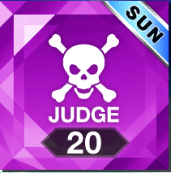{: style="width: 100px"}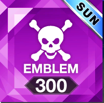{: style="width: 100px"}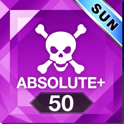{: style="width: 100px"}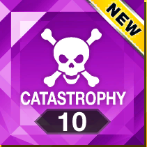{: style="width: 100px"} |

Matching skills only have effects when matching with other players, support and defense skills generally have minor protective effects (e.g. negate map gauge penalty when missing up to X times) and are not worth using when you unlock better ones.

Boost skills are the most common in the game, taking the effect of boosting the map gauge in ways such as adding fixed amounts every combo interval, attaching a positive multiplier to the gauge, or adding a fixed amount of map gauge at the end of the chart, among others.

Danger skills are generally the strongest, but come with severe penalties for poor performance including **force quitting** you out of the chart if you mess up enough.

In Chunithm NEW and beyond, obtaining and leveling characters will reward you **skill seeds**, which strengthen skills of a certain type and increase their efficacy.

The specific values and formulas that drive the map clear system are outside of the scope of this guide and people seeking more information should check the jp [wiki](https://gamerch.com/chunithm/entry/490095).

## Skill Tables 

### Version-Dependent Skills (SUN+ ~ LUMINOUS+)

The following is a skill table for skills that reward skill frames. All danger skills have a certain threshold of notes that, once met, will force quit the chart. Specific information about each skill can be read about on [wikiwiki (jp)](https://wikiwiki.jp/chunithmwiki/%E3%82%B9%E3%82%AD%E3%83%AB%E6%AF%94%E8%BC%83%28NEW%EF%BD%9E%29).

"No skill" is also an option that can be selected, if desired.

| Skill Name                                 | Icon                                                                        | Description                                                     | Force Quit Threshold |
| :----------------------------------------- | :-------------------------------------------------------------------------- | :-------------------------------------------------------------- | :------------------- |
| All Guard (**Guard**) [NEW/SUN]            | {: style="width: 100px"}             | Bonus starting gauge (6000/9000 base) Negates damage 20 times   | -                    |
| Angel's Breath (**Support**) [NEW]         | {: style="width: 100px"}         | Bonus starting gauge (12000 base)                               | -                    |
| Gauge boost (**Boost**) [NEW/SUN]          | {: style="width: 100px"}             | Gauge multiplier increase (160%/170% base)                      | -                    |
| Combo extend (**Combo**) [NEW/SUN]         | {: style="width: 100px"}             | Bonus gauge every 100 combo (2500/3000 base)                    | -                    |
| Attack Guilty (**A-Guilty**) [NEW/SUN]     | {: style="width: 100px"}        | Gauge multiplier increase (170%/175% base) 300 damage on ATTACK | -                    |
| Judgement (**Judge**) [NEW/SUN]            | {: style="width: 100px"}             | Gauge multiplier increase (200%/210% base)                      | 20 Miss              |
| Over Judge (**Judge+**) [NEW/SUN]          | 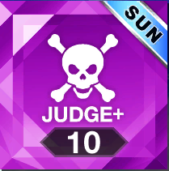{: style="width: 100px"}           | Gauge multiplier increase (220%/230% base)                      | 10 Miss              |
| Sign of mourning (**Emblem**) [SUN]        | {: style="width: 100px"}           | Bonus gauge for Justice Critical judgement (22.5 base)          | 300 Justice or below |
| Combo burst (**Absolute**) [NEW/SUN]       | 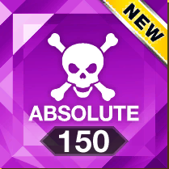{: style="width: 100px"}       | Bonus gauge every 150 combo (6000 base)                         | 150 Justice or below |
| Sign of courage (**Emblem+**) [SUN]        | 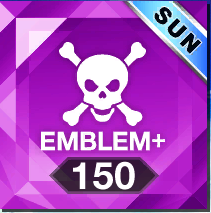{: style="width: 100px"}         | Bonus gauge for Justice Critical judgement (30 base)            | 150 Justice or below |
| Jester's Madness (**Absolute+**) [NEW/SUN] | {: style="width: 100px"}     | Bonus gauge every 100 combo (6000/7000 base)                    | 50 Justice or below  |
| Creation (**Catastrophy**) [NEW]           | {: style="width: 100px"} | Gauge multiplier increase (350% base)                           | 10 Justice or below  |

Clearing with different skills will reward different skill frames, in order of highest priority (hardest skill). More details are in the Chart Clear Indicators section below.

### Version-Dependent Skills (VERSE~)

| Skill Name                                 | Icon                                                                        | Description                                                     | Force Quit Threshold |
| :----------------------------------------- | :-------------------------------------------------------------------------- | :-------------------------------------------------------------- | :------------------- |
| Gauge boost [NORMAL]                       | {: style="width: 100px"}       | Gauge multiplier increase (175% base)                           | -                    |
| Combo extend [NORMAL]                      | 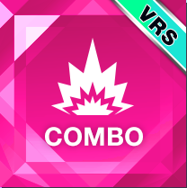{: style="width: 100px"}       | Bonus gauge every 100 combo (3500 base)                         | -                    |
| Judgement [HARD]                           | 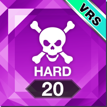{: style="width: 100px"}        | Gauge multiplier increase (215% base)                           | 20 Miss              |
| Over Judge [HARD]                          | {: style="width: 100px"}       | Gauge multiplier increase (235% base)                           | 10 Miss              |
| Sign of mourning [HARD]                    | 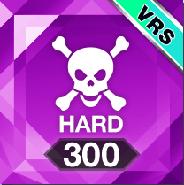{: style="width: 100px"}       | Bonus gauge for Justice Critical judgement (22.5 base)          | 300 Justice or below |
| Sign of courage [BRAVE]                    | {: style="width: 100px"}     | Bonus gauge for Justice Critical judgement (32.5 base)          | 150 Justice or below |
| Jester's Madness [ABSOLUTE]                | {: style="width: 100px"}     | Bonus gauge for Justice Critical judgement (52.5 base)          | 50 Justice or below  |
| Creation [CATASTROPHY]                     | 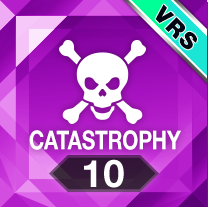{: style="width: 100px"}   | Gauge multiplier increase (360% base)                           | 10 Justice or below  |

All previous version skills were deleted and replaced. Guard, Support, and Attack Guilty were permanently removed, other skills were renamed:
- HARD/EMBLEM → HARD (20 miss, 10 miss, 300 justice)
- ABSOLUTE → BRAVE (150 justice)
- ABSOLUTE+ → ABSOLUTE (50 justice)

### General Skills

The following four skills are also available in addition to the above version-specific skills.

| Skill Name                                    | Icon                                                                        | Description                                                                                                           | Force Quit Threshold |
| :-------------------------------------------- | :-------------------------------------------------------------------------- | :-------------------------------------------------------------------------------------------------------------------- | :------------------- |
| Proof of limit break (**Unlimited**)          | {: style="width: 100px"}     | Gauge multiplier increase (100% base) Bonus 30000 gauge when 1,010,000 points reached                                 | -                    |
| Proof of limit break - true (**Unlimited+**)  | 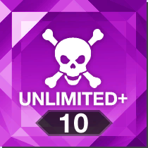{: style="width: 100px"}   | Gauge multiplier increase (150% base) Bonus 50000 gauge when 1,010,000 points reached                                 | 10 Miss              |
| Proof of limit break - bond (**Unlimited++**) | {: style="width: 100px"} | Gauge multiplier increase (200% base) 3000 damage on Justice or below Bonus 30000 gauge when 1,010,000 points reached | -                    |
| Campaign boost (**Campaign**)                 | {: style="width: 100px"}       | Bonus gauge depending on rank S: 35000 SS: 54000 SSS: 72000                                                           | -                    |

## Chart Clear Indicators

Songs will display a set of badges/indicators/frames based on the achievement of certain metrics. Generally, the harder the requirement the "nicer" the indicator will look (e.g. silver/gold/rainbow).

**Example**:

There are 4 standard clear indicators/frames:

### Clear Lamps (SUN+ ~ LUMINOUS+)
| Frame | Icon                                                                                                                                                                                                                                                                                                                                                                                                                                            | Description                                                                                                                                                                                                                                                                       |
| :---- | :---------------------------------------------------------------------------------------------------------------------------------------------------------------------------------------------------------------------------------------------------------------------------------------------------------------------------------------------------------------------------------------------------------------------------------------------- | :-------------------------------------------------------------------------------------------------------------------------------------------------------------------------------------------------------------------------------------------------------------------------------- |
| Skill | {: style="width: 100px"}{: style="width: 100px"}{: style="width: 100px"}{: style="width: 100px"}{: style="width: 100px"}                                                                                                                           | Rewarded based on the highest difficulty skill equipped Chunithm SUN PLUS~ **Clear**: any Defense/Support/Boost skill **Hard**: Judge/Judge+/Emblem skill **Absolute**: Absolute/Emblem+ skill **Absolute+**: Absolute+ skill **Catastrophy**: Catastrophy skill                  |
| Rank  | {: style="width: 100px"}{: style="width: 100px"}{: style="width: 100px"}{: style="width: 100px"}{: style="width: 100px"}{: style="width: 100px"}{: style="width: 100px"} | Rewarded based on highest achieved rank Chunithm NEW~SUN PLUS **Grey** frame: D/C rank **Silver** frame: B/BB/BBB rank **Gold** frame: A/AA/AAA rank **Platinum** frame: S/S+/SS/SS+/SSS rank Chunithm LUMINOUS~ **Rainbow** frame: SSS+ rank                                     |
| Combo | {: style="width: 100px"}{: style="width: 100px"}{: style="width: 100px"}                                                                                                                                                                                                                                                   | Rewarded based on highest achieved combo status Chunithm NEW~SUN PLUS **Gold** frame: full combo **Platinum** frame: all justice Chunithm LUMINOUS~ **Rainbow** frame: all justice critical                                                                                       |
| Chain | {: style="width: 100px"}{: style="width: 100px"}                                                                                                                                                                                                                                                                                                                   | Rewarded for matching play where all players maintain combo Chunithm PARADISE LOST~ **Gold** frame: full chain but the matching partner achieved full combo on an easier difficulty (the other player will receive a platinum frame) **Platinum** frame: full chain + all justice |

### Clear Lamps (VERSE~)
| Frame | Icon                                                                                                                                                                                                                                                                                                                                                                                                                                            | Description                                                                                                                                                                                                                                                                       |
| :---- | :---------------------------------------------------------------------------------------------------------------------------------------------------------------------------------------------------------------------------------------------------------------------------------------------------------------------------------------------------------------------------------------------------------------------------------------------- | :-------------------------------------------------------------------------------------------------------------------------------------------------------------------------------------------------------------------------------------------------------------------------------- |
| Skill | {: style="width: 100px"}{: style="width: 100px"}{: style="width: 100px"}{: style="width: 100px"}{: style="width: 100px"}                                                                                                                           | Rewarded based on the highest difficulty skill equipped Chunithm SUN PLUS~ **Clear**: any Defense/Support/Boost skill **Hard**: Judge/Judge+/Emblem skill **Absolute**: Absolute/Emblem+ skill **Absolute+**: Absolute+ skill **Catastrophy**: Catastrophy skill                  |
| Rank  | {: style="width: 100px"}{: style="width: 100px"}{: style="width: 100px"}{: style="width: 100px"}{: style="width: 100px"}{: style="width: 100px"}{: style="width: 100px"} | Rewarded based on highest achieved rank Chunithm NEW~SUN PLUS **Grey** frame: D/C rank **Silver** frame: B/BB/BBB rank **Gold** frame: A/AA/AAA rank **Platinum** frame: S/S+/SS/SS+/SSS rank Chunithm LUMINOUS~ **Rainbow** frame: SSS+ rank                                     |
| Combo | {: style="width: 100px"}{: style="width: 100px"}{: style="width: 100px"}                                                                                                                                                                                                                                                   | Rewarded based on highest achieved combo status Chunithm NEW~SUN PLUS **Gold** frame: full combo **Platinum** frame: all justice Chunithm LUMINOUS~ **Rainbow** frame: all justice critical                                                                                       |
| Chain | {: style="width: 100px"}{: style="width: 100px"}                                                                                                                                                                                                                                                                                                                   | Rewarded for matching play where all players maintain combo Chunithm PARADISE LOST~ **Gold** frame: full chain but the matching partner achieved full combo on an easier difficulty (the other player will receive a platinum frame) **Platinum** frame: full chain + all justice |

By achieving a minimum level of clear indicators within a folder, a **folder indicator** will appear on the folder tab matching the highest achieved status (only skill frame of Absolute or higher and rank frame of S or higher are displayed).

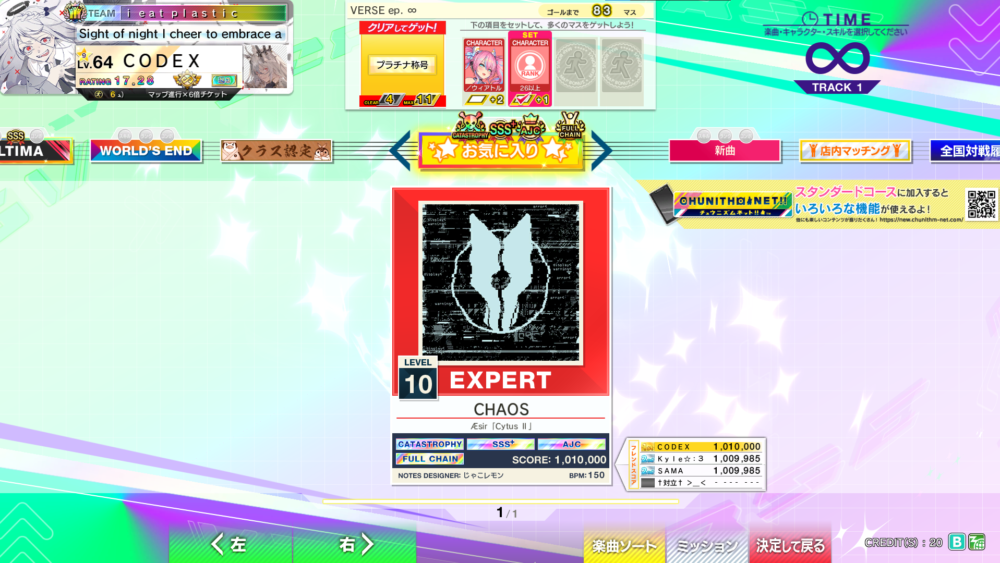

**VERSE**: folder indicators for skill, rank, and combo are now displayed regardless of whether the player has achieved them.

{: style="width: 200px"}

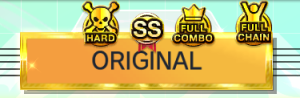{: style="width: 200px"}

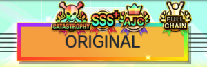{: style="width: 200px"}
