# Cosmetics and Reward Systems

## Penguin Avatar

**NEW**: players now have their very own **Penguin Avatar** that will show up in the bottom left of the play area throughout the game.

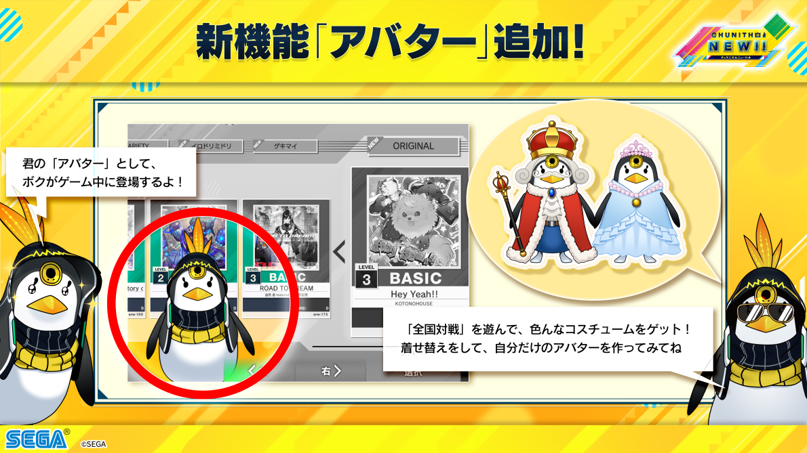

Players can unlock various dress-up items to customize their penguin avatars through the map system and various presents. Upon unlocking a new item, a player can choose to equip it at the end of the credit, but any further changes (e.g. changing to previous items) must be done through [chunithm-NET](https://new.chunithm-net.com/) or a similar WebUI service.

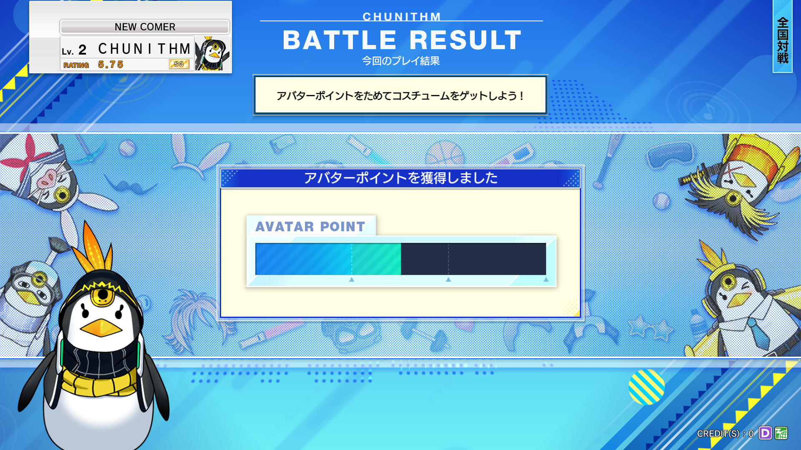

**SUN**: when playing **Online Battle**, players will collect avatar points during normal play, which fill up an "avatar point gauge". Once the gauge reaches a line, the player enters "avatar chance" where they can select up to three presents containing avatar items depending on how full the point gauge is. These presents specify the category of what their items belong to, such as "item", "wear", "head", etc.

<figure markdown="1">
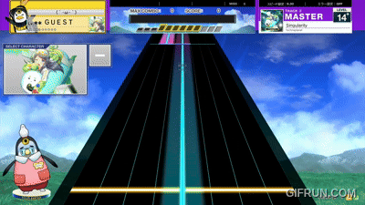
</figure>

This penguin avatar will be present during gameplay and will display animations like being "fired up" when a player has high combo or flailing in shock when the player misses a note. Unfortunately, the penguin avatar cannot be removed from the gameplay screen.

## Chunithm Duel

Introduced in Chunithm AMAZON and running until **SUN+**, Chunithm duels were a progression system that allowed players to unlock **map icons**, **nameplates**, and **system voices**.

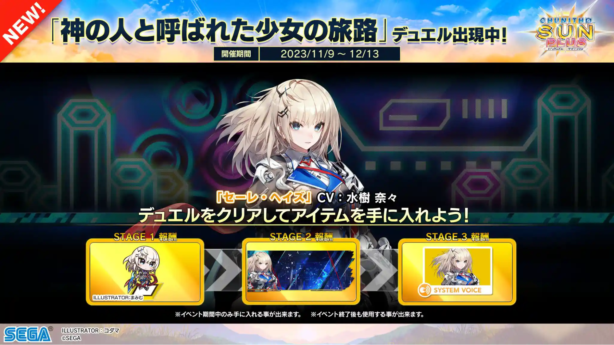

Duel missions would appear on the song select screen during a credit, and completing them would increase the damage done to the ‘boss' of the Chunithm Duel when the credit is over. Bosses would have three stages, each having an increasingly larger health bar and rewarding different items (as shown above).

More details about Chunithm Duel can be found on the [JP wiki](https://wikiwiki.jp/chunithmwiki/%E3%83%81%E3%83%A5%E3%82%A6%E3%83%8B%E3%82%BA%E3%83%A0%E3%83%87%E3%83%A5%E3%82%A8%E3%83%AB).

## Chunithm Mission

**LUMINOUS**: Chunithm Mission replaces Chunithm Duel, taking the bonus tasks present in previous versions of the game and unifying them under a continuous progression system where task completion is rewarded with balloons.

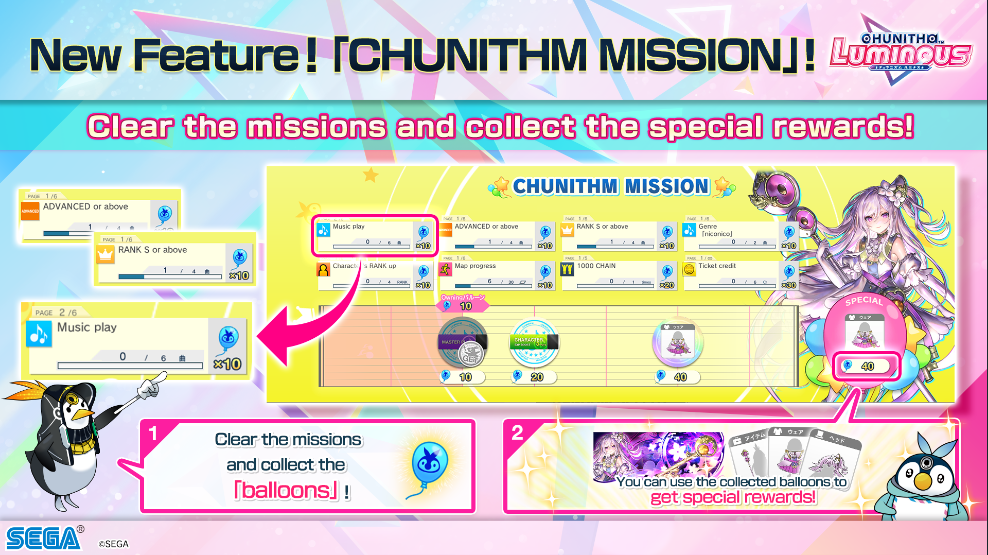

At the end of the credit, balloons will be awarded depending on task completion and the progress gauge will fill up. At specified balloon counts, the player can acquire rewards such as map tickets and cosmetic items for their penguin avatar or the player card.

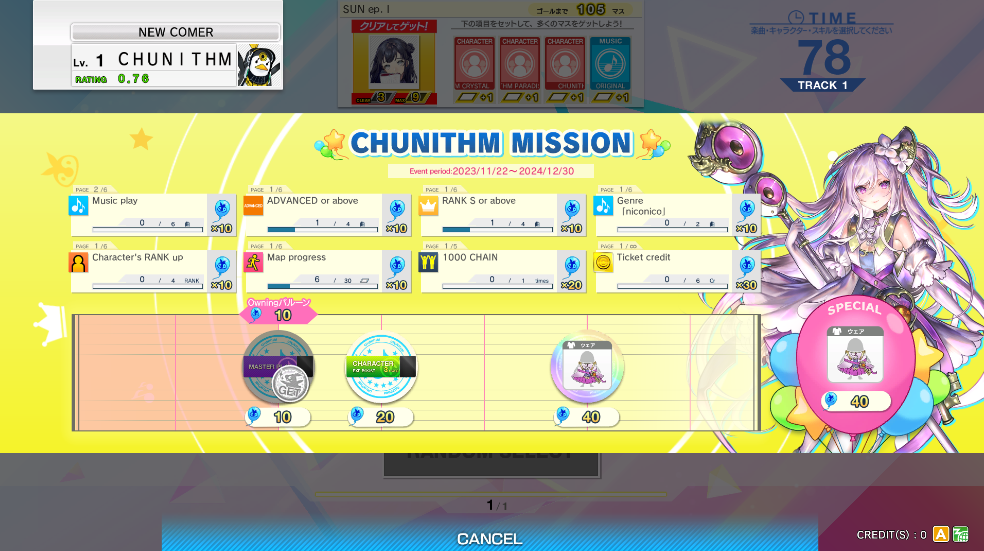

The player can also check their assigned tasks in the song selection menu by selecting the "mission" button just off the right side of the slider in between the "song sort" and "return to selection" buttons.

More details on Chunithm Mission can be found on the [JP wiki](https://wikiwiki.jp/chunithmwiki/%E3%83%81%E3%83%A5%E3%82%A6%E3%83%8B%E3%82%BA%E3%83%A0%E3%83%9F%E3%83%83%E3%82%B7%E3%83%A7%E3%83%B3).

## Chunithm Achievement

**LUMINOUS+**: Chunithm Achievement is a progression system tracked across a user's account. Split by difficulty, persistent quests such as "Rank SSS/Full Combo/All Justice/Absolute Skill Clear,"  are displayed. Once a player has achieved a given milestone, they are rewarded a number of "Trophy Stars" as indicated by the quest. There are separate tabs for the entire game and the current version.

This view can be seen by pressing the "MISSION" button on the music category selection screen, followed by pressing "CHANGE CATEGORY".

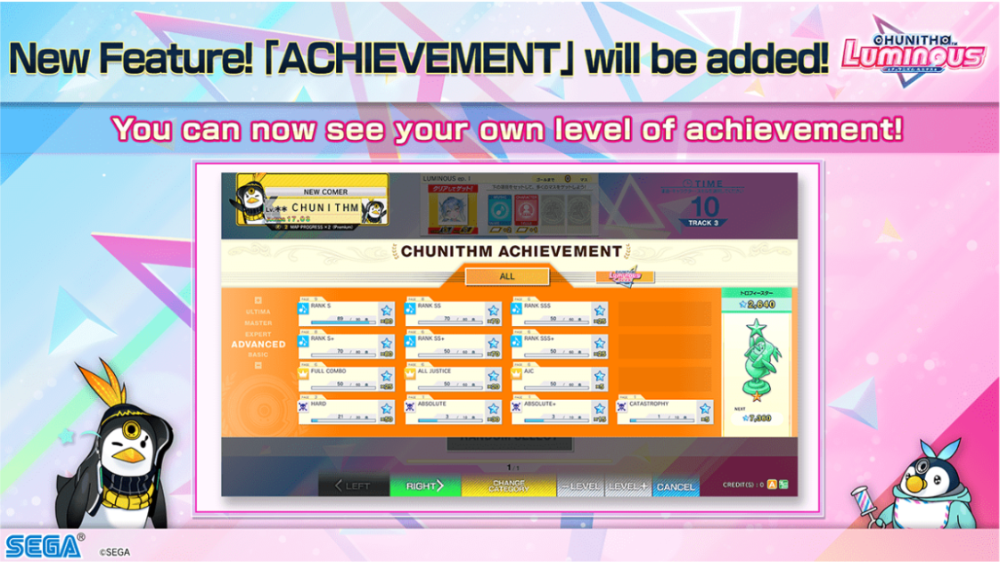

As more stars are acquired, the rank of the Player Trophy will increase at given intervals; the number of starts required to reach the following tier is displayed underneath the trophy on the right side of the screen.

<figure markdown="1">
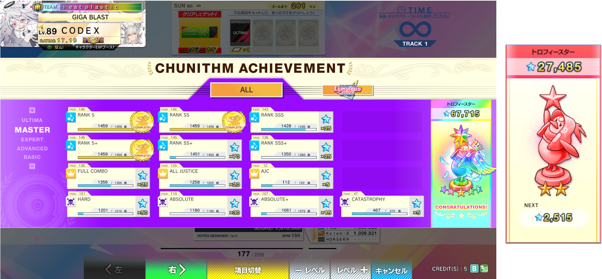
<figcaption>A view of the MASTER difficulty with maxed Trophy (L), a snapshot of the EXPERT difficulty 2* Trophy (R).</figcaption>
</figure>

**VERSE**: Chunithm Achievement can now be viewed for every version of the game.

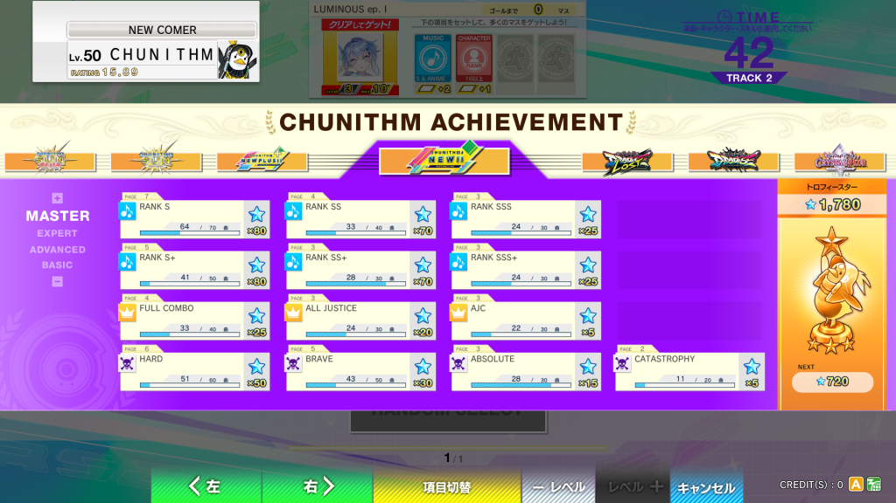

## Folder Titles

**VERSE**: "premium" titles based on the versions of Chunithm were introduced. These special titles require completion of **all difficulties** (except Ultima) of **all charts** within the version folder. There are three tiers for these titles, all **rank S** or above (Spirit), all **rank SSS** or above (Tribute), and all **All Justice** (Legend).

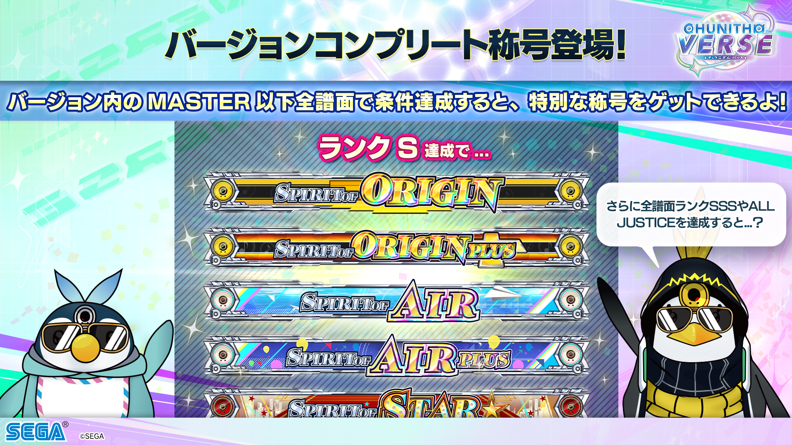

Additionally, you may now equip up to **three** titles on your profile. In gameplay, these titles will rotate in sequence by fading in and out with each other.

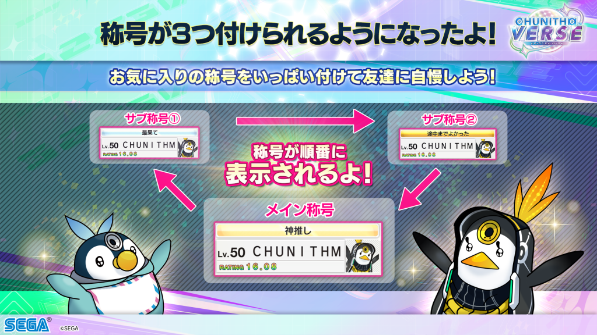
