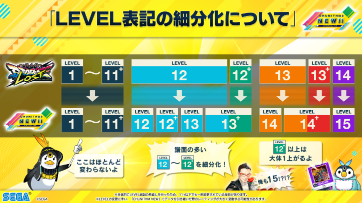

# Difficulty and Levels

There are 4 main difficulty levels in Chunithm through to **PARADISE LOST**, which include **Basic** (BAS), **Advanced** (ADV), **Expert** (EXP), and **Master** (MAS). Chunithm **NEW** and higher also include an additional 5th difficulty, **Ultima** (ULT). If you have previously played vertical scrolling rhythm games like ProSeka, Deemo, SDVX, or any mania-type game, you will probably be comfortable playing Advanced or lower Expert charts, but there's no harm in playing Basic charts to familiarize yourself with the game.

By default, the game will not allow you to play **Master** charts until you have achieved a rank of S or higher the Expert difficulty of the same chart ("clearing" is not required). However, this can be circumvented by using a **Boost Ticket** that allows you to play Master charts without unlocking them first. They will remain unlocked if a rank of S or higher is achieved. To unlock **Ultima** charts, you are required to achieve SS or higher on both the **Expert** and **Master** charts of the song in question, or by using a **Boost Ticket** or **Ultima Play Ticket**. Unlike Master charts, scoring well on the Ultima chart will not unlock the chart permanently.

**PARADISE LOST**: charts are rated from **1-14**, while in newer versions (**NEW** and up), charts are rated from **1-15**. Many charts previously rated 12 and higher were generally re-rated to better separate difficulty. Charts above difficulty 7.0 have hidden **chart constants** that lie between the simple integers the game displays which affects player rating.

**PARADISE LOST** charts that end in a constant of .7 to  .9 will have a \+ indicator (.5 to .9 in **NEW** and up), such as 12+ or 13+. Chart constants can be checked on the Chunithm Chart Codex ([current version link](https://chunithm.org/codex)) and jp wiki gamerch also lists [past versions](../index.md#chart-constants-by-version).

The image below is a quick visual guide to how the chart constants were adjusted. A good rule of thumb is to **add 1.0** to the chart difficulty when attempting to convert chart constants above 12 between Chunithm **PARADISE LOST** and **NEW**.

**VERSE**: charts near the upper end of the 14+ folder have had their chart constants increased, such that the new difficulty ceiling is 15+ (following the introduction of Forsaken Tale MAS in LUMINOUS PLUS). New chart constants can be monitored at this [Google Sheet](https://docs.google.com/spreadsheets/d/1NTGkrOoLdzOoaYyz7d4vDT3cW2Q6lZfoc1nvd7nlNLE/edit?gid=1971412612#gid=1971412612), although it is in the process of being updated.
