# Gameplay and Note Types

If you've played other popular mobile rhythm games such as **Deemo** or **Project SEKAI** (also known as Hatsune Miku: Colorful Stage! in NA), or classic vertical scrolling rhythm games (VSRGs) like **SDVX** and **beatmania IIDX**, then you will pick up the basic gameplay of Chunithm very quickly. Essentially, notes come down from the top of the gameplay field , and you have to hit notes on the judgement line. The more precise the timing, the better you will score.

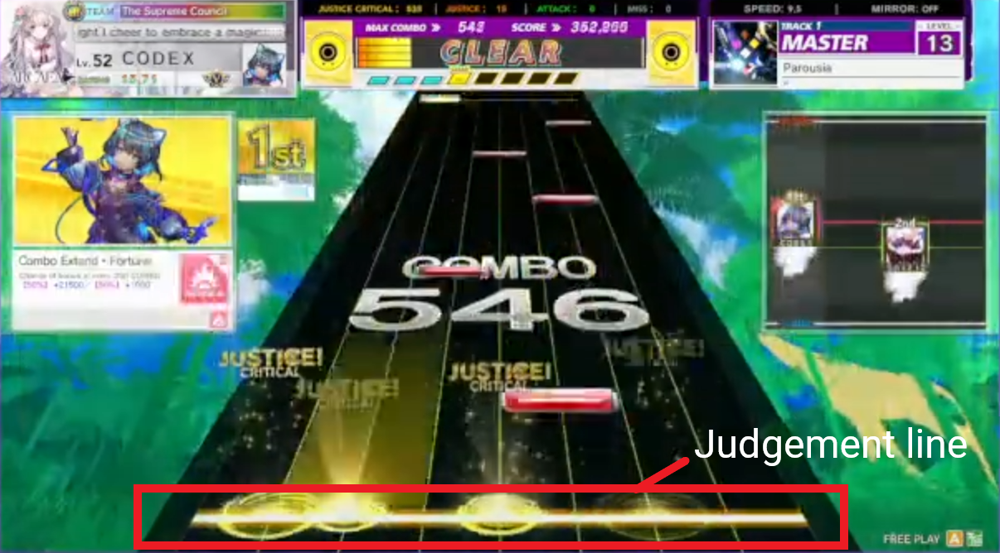

Here is a list of all of the note types in the game:

## Tap/ExTap Notes

**Tap** notes are red bars that will scroll down on the play field. They can be any size, and any input on the ground slider that hits a portion of the tap note will trigger it.

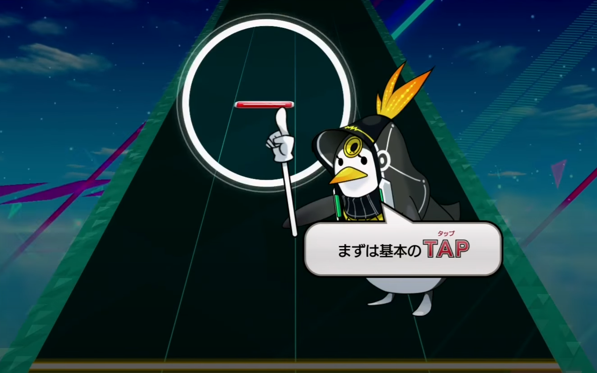

This means you **do not have to hit the notes directly in the center**, and you are allowed to hit an area on the slider that is **wider** than the note itself or part of a note and it will still count. However, you can trigger tap notes that might be very close to the left or right of the note you are trying to hit accidentally ("splashing") and so you still want to be precise when you can.

There are also **ExTap** notes, which are coloured yellow instead of red. These have a much more generous timing window and always guarantee a ‘Justice Critical' judgement.

## Hold Notes

**Hold** notes are yellow bars requiring you to maintain an input on the ground slider until the last part of the hold passes the judgement line (notable exception for holds that end in **air notes**, and "[fake holds](../advanced/cheating.md#fake-holds)"). The beginning of holds are treated like tap notes, and they have non-visible checkpoints within them to check if players are still holding down the note (more details in [Timing Windows](timing.md#hold-timing-windows)). Unlike games like Project Sekai or Beatmania IIDX, you do **not need to worry about release timing**. The game will not penalize you for holding past the end of the note.

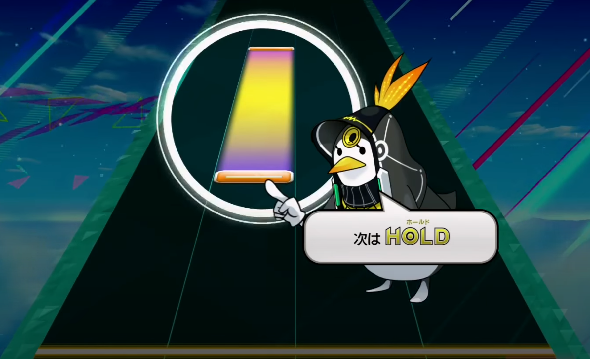

## Slide Notes

**Slide** notes are blue bars that are basically holds that move from side-to-side. You *generally* need to follow the movement of the blue bars as they pass the judgement line. These range from very simple to very complex. One of the main techniques in the game, [crosshanding](../intermediate/tech.md#crosshanding), requires you to be able to read certain slide patterns to effectively hit them.

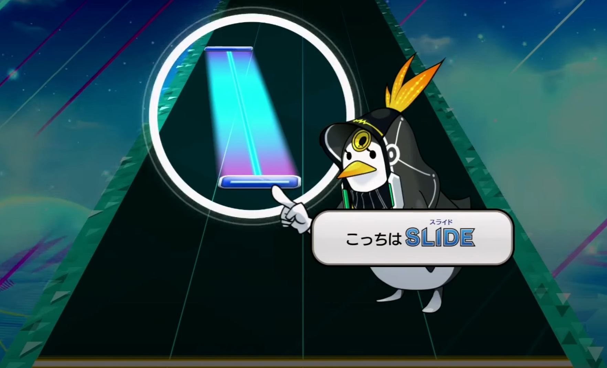

If the hitbox of the slide stays within the starting position, you can treat slide notes like hold notes and do not have to move. However, if the slide moves out of the starting hitbox, you must **follow it with your hand**. The graphic below demonstrates this concept.

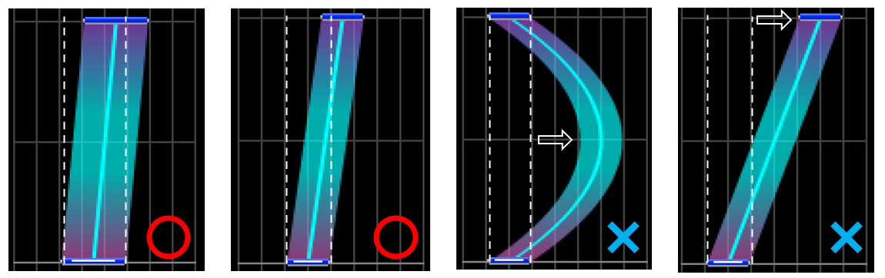

On the back end, slide notes actually check for **changes** in inputs across the slider that they cover, so widehanding over the entire hitbox will not work and will result in the slide dropping.

Thin slides (e.g. Bad Apple, スカイクラッドの観測者) can be a pain to deal with as well as it is very easy to drop the input if you're not careful. For a technique that will help players avoid dropping slides, please see the section [*Rubbing Thin Slides*](../advanced/patterns.md#rubbing-thin-slides).

## "Fake ExTap" Notes

You may occasionally see a hold or a slide note that has the beginning part glow yellow like an ExTap.

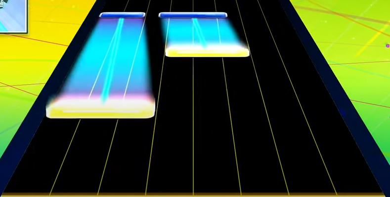

In all charts up to Chunithm NEW (including all PARADISE LOST charts), this is charted as an ExTap stacked **on top of** a standard hold or slide. This means that it is possible to receive non-Justice Critical judgements such as Justice or Attack despite it looking like an ExTap note.

**NEW+**: some charts have changed the beginning of holds and slides to function like an actual ExTap without stacking an extra note on top, and some charts where this change has been implemented include a "【Ex】" marking at the beginning of the "Notes Designer" field at the bottom of the song panel (e.g. エバ, アナタニナルノ, etc.).

**LUMINOUS**: Fake ExTap notes on holds are **fixed** for all charts, and should all act like proper ExTap when the version updates. The【Ex】indicator has also been removed from the note designer field.

## Air Notes

Next up are **air** notes, which are green arrows that can appear above **all other** note types.

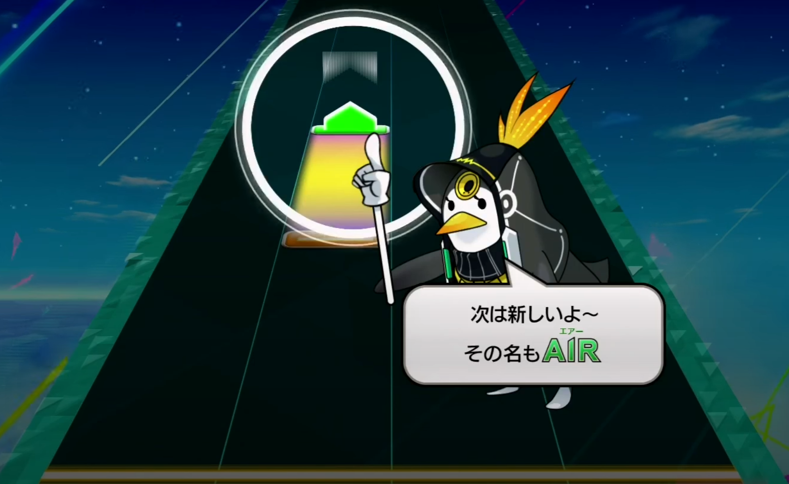

Air notes require you to raise your hand **vertically** so that the air sensors on the side register movement. A few things of note regarding air notes:

* Air sensors cannot read horizontal placement, so you do **not** need to lift a specific hand, either will do;
* You do **not** need to pass through the middle of the air sensor;
* Air notes do **not** distinguish direction of vertical movement, so you can trigger "up" airs with a downwards hand movement;
* Although air notes will sometimes appear diagonal, you do **not** need to follow the direction of the air note;
* You don't even need to use your hands, as the gif below nicely illustrates (this is an intended mechanic in a handful of charts).

<figure markdown="1">

</figure>

"Down" air notes also exist and have slightly adjusted timing windows from "up" air notes. The timing for air notes is **very broad** (more details in [Timing Windows](timing.md#air-timing-windows) below), so essentially if you raise or wave your hands/arms, you will generally easily trigger air notes.

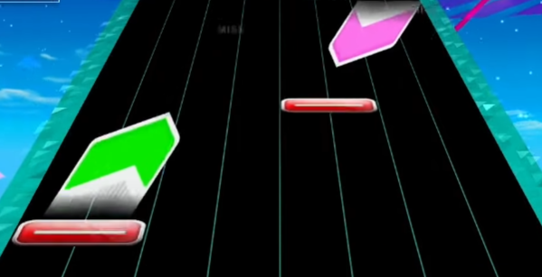

## Air-Action Notes

**Air-action** notes are extensions of air notes, and they go hand in hand with "air-holds".

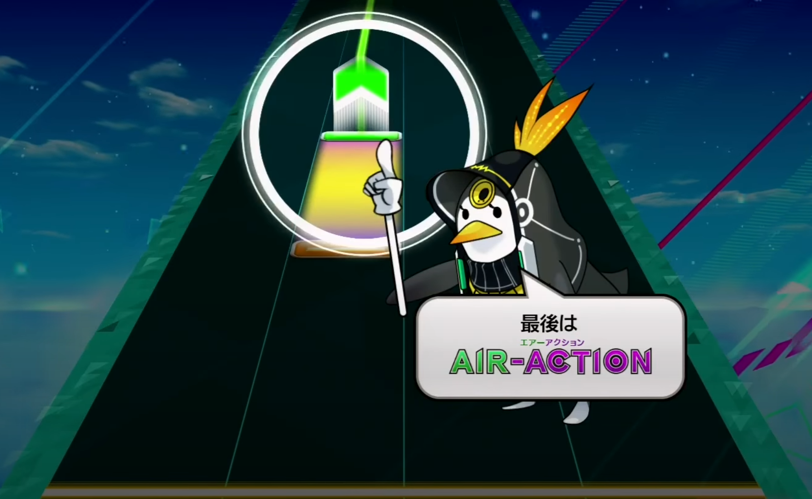
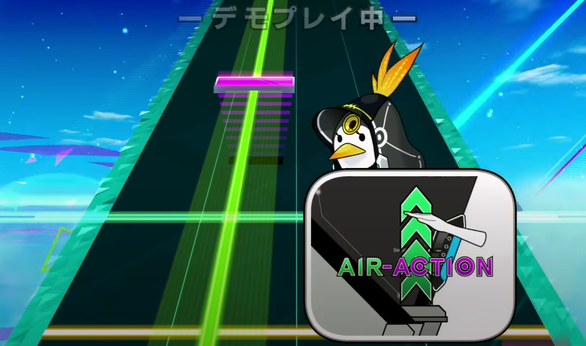

The green line stemming from the initial **air** note indicates that you need to **keep** your hand within the air sensor region (the "air-hold"), and purple bars that fall towards the judgement line (the **air-action**) are again triggered by **movement** **within the air sensor region**. This can be movement up through the sensor, down through the sensor, or even waving up and down. Timing windows are similarly generous.

If a player misses air notes on charts of **expert** difficulty and below, the game will flash a graphic in the bottom right of the screen telling the player to raise their hand higher. Unfortunately, this cannot be toggled off.

<figure markdown="1">
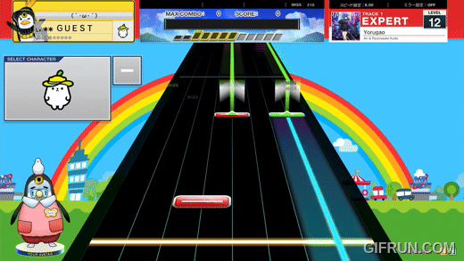
</figure>

## Air-Crush Notes (Chunithm NEW~)

**Air-Crush** notes are similar to air-action notes, and appear as light purple floating bars. They do not have to be attached to air-holds, and similarly you simply have to trigger any air movement to hit them.

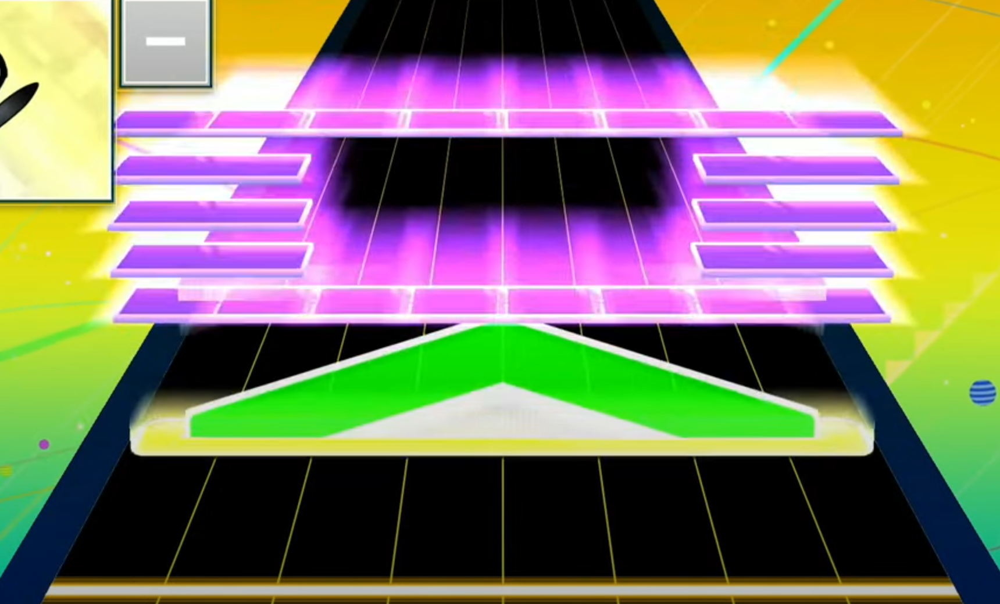

## Flick Notes

**Flick notes** are silver with blue centers, and they require **horizontal movement** within the judgement window to be triggered (you cannot "just treat them like tap notes"). They will **only** appear in **MASTER** or ULTIMA difficulty charts.

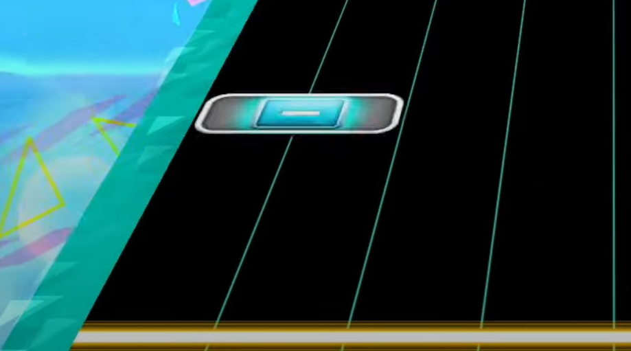

Basically, you need to slide your hand or fingers in the region where the flick note appears. For individual flick notes, the direction you move does **not matter**, it can be left to right or right to left. In harder charts, the game starts to chain them together to make certain patterns like [flick slides](../intermediate/tech.md#tapflick-slides). There are also advanced techniques to trigger flick notes ([flick tech](../advanced/cheating.md#flick-tech)).
