# Game Screen

There is a lot of information on the screen at any given time. Here's how to read it and understand what it all means.

## Song Select

The song select screen is where players pick the chart they want to play. The songs are sorted by **genre** by default, although this can be changed to sort by **song name** or the **game version** the songs were released in. If unlocked, World's End and Course Mode (**NEW**~) can also be accessed from song select. There will also be fixed tabs for selection by **chart level**, **random** (by difficulty bracket), and ULTIMA (**NEW**~). [Special **badges**/frames](characters.md#chart-clear-indicators) (e.g. S-SSS+, Full Combo, All Justice) will also appear on folders when requirements are met.

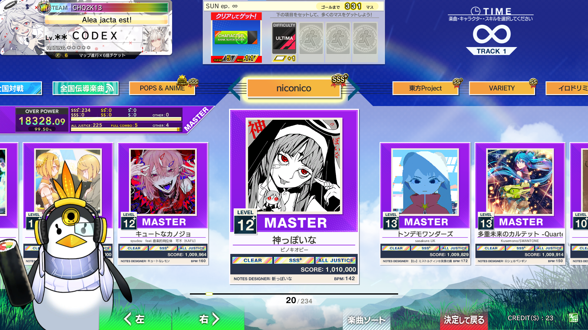

<figure markdown="1">
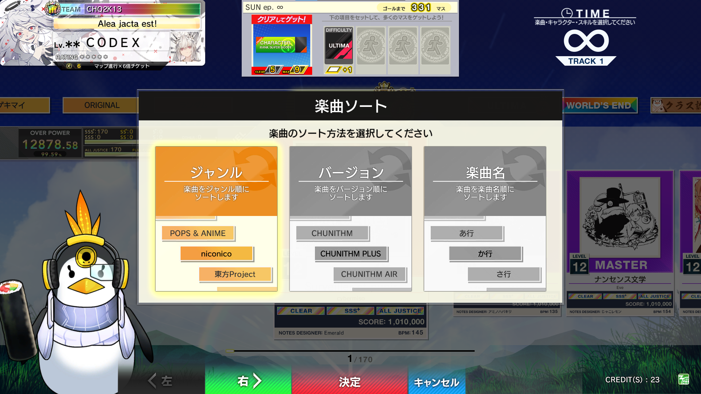
<figcaption>Genre sort - Version sort - Name sort (Japanese alphabet)</figcaption>
</figure>

**LUMINOUS+**: additional sorting options were introduced. Charts within the three broad categories can now be **sub-sorted** by Genre (if you are in Version/Name sorting), Music Title, Date of Addition, Level, Score, All Justice/Full Combo achievement, Skill Clear Mark, or Full Chain.

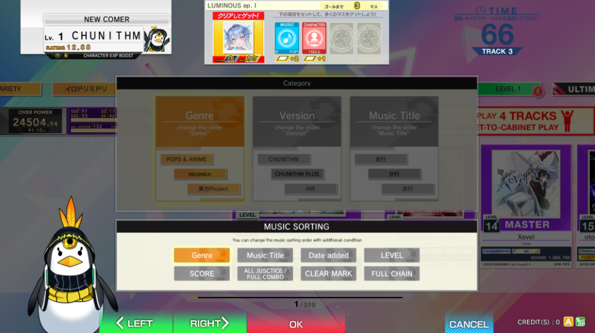

**VERSE**: sub-sorting can be additionally toggled by ascending or descending order.

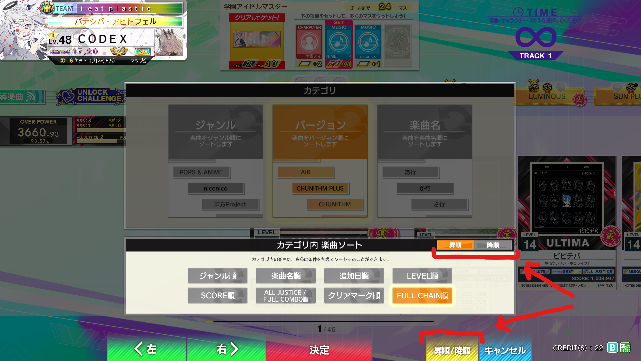

Other permanent folders exist for "Team Exclusives", Favourites (which are selected on Chunithm.NET in supported regions or in the [final check](#final-check) menu in **LUMINOUS+**), New Songs, Matching History, Online Battle (全国対戦), and Online Battle History.

Online Battle (全国対戦) was introduced in **NEW**, and is a matchmaking mode where players are (theoretically) placed in lobbies against other players of similar skill level and compete against each other across 4 songs as each player gets to pick one.

Winning in online battle results in your "Battle Rank" increasing, which is shown on your nameplate and can also impact other cosmetic items like titles. Online Battle is only implemented in the JP server.

**VERSE**: addition of the recommendation folder. It contains general pickup songs, songs that are catered to the player's music taste (based on recent plays), and recommended charts for rating based on other players of similar rating.

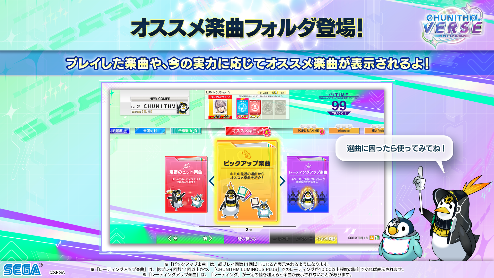

!!! mitsuyoshi "Mitsuyoshi Tip!"
    <strong id="mitsuyoshi-1">Rainbow song frames</strong>

    One cool lesser-known cosmetic feature is that achieving All Justice on every difficulty of the same song (Basic, Advanced, Expert, Master) will result in a **rainbow** effect being applied to the frame of the song.

## Final Check

The final check screen will be entered once a song has been selected. The options on this screen, from left to right, are as follows: [**Matching**](matching.md), [**Character and Skill**](characters.md), **Game Start**, [**Settings**](settings.md), and **Headphone Volume**. The Matching, Character and Skill, and Settings options are all covered in their own sections; the start song option will ask for a final yes/no confirmation before beginning gameplay (unless the timer runs out), and headphone volume will adjust the game volume if headphones are plugged in. Speaker volume cannot be changed by players, and you have to ask an arcade operator to adjust that if it is too quiet/loud.

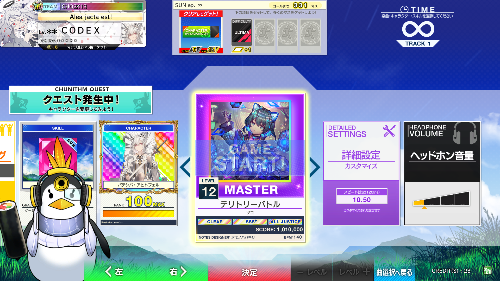

**LUMINOUS+**: you can now set **Favorite Charts** in-game at the Final Check screen. The favorite chart toggle is placed in between Settings and Headphone Volume.

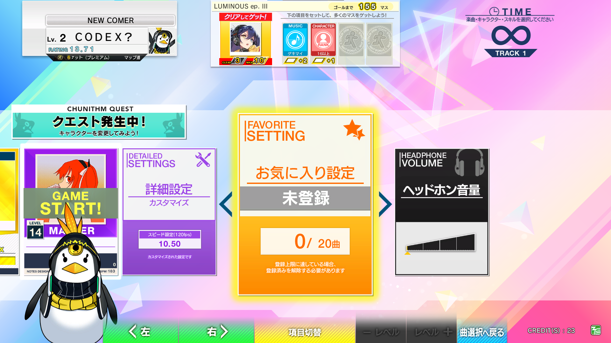

## Gameplay

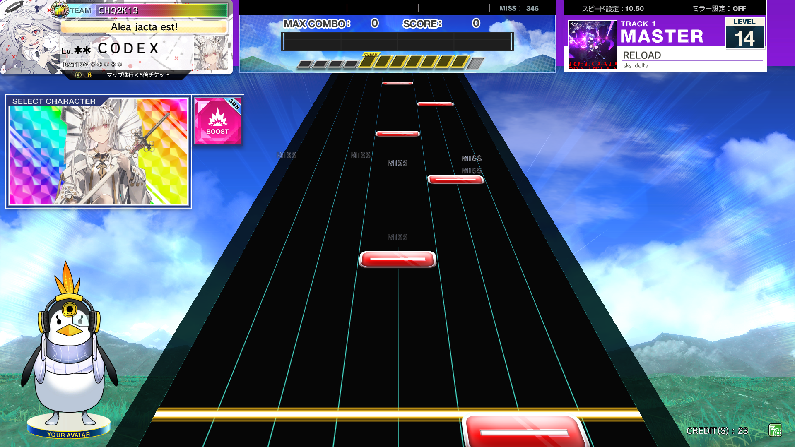

Let's take this gameplay image and break it down into sections.

In the top-left, you have the **Player Card**. Top to bottom, this displays the Team name, the active player title, player level, player username, player rating, course badges/banners, and the selected character being used. Some of these are customizable, including the title, character, and nameplate, and other objects are stats, such as the player level, rating, and class badge/banner.

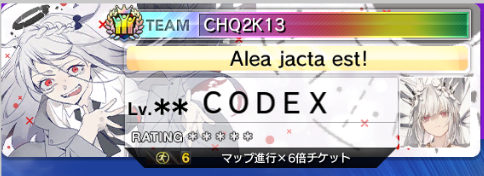

In the upper-middle section, you have the **score tracker**. The number of judgements is tracked on the very top, and underneath the highest achieved combo and current score are displayed. The large bar and the parallelograms underneath are indicators for the **map system**, which we will discuss later.

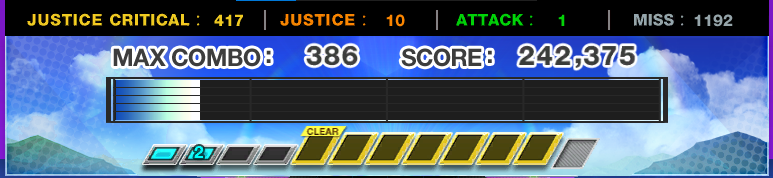

In the top-right, you have the **scroll speed indicator**, the mirror indicator, and the **chart indicator**. The chart indicator changes colour based on the difficulty of the chart, and also displays the cover art, song name, the artist of the song, and the level of the chart. It also displays what track the current session is on.

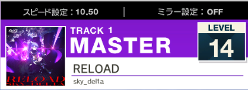

!!! mitsuyoshi "Mitsuyoshi Tip!"
    <strong id="mitsuyoshi-2">Last song side LED colour</strong>

    One quick way to tell whether a player is almost done with a set is to look at the LEDs on the side air sensors. They change colour from green/white to pink on the **last** chart of a set.

On the left hand side, the character portrait and skill description are displayed. For more information, see [character and skills](characters.md). The placement of the player will also be displayed if matching occurs.

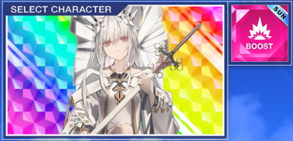

## Results

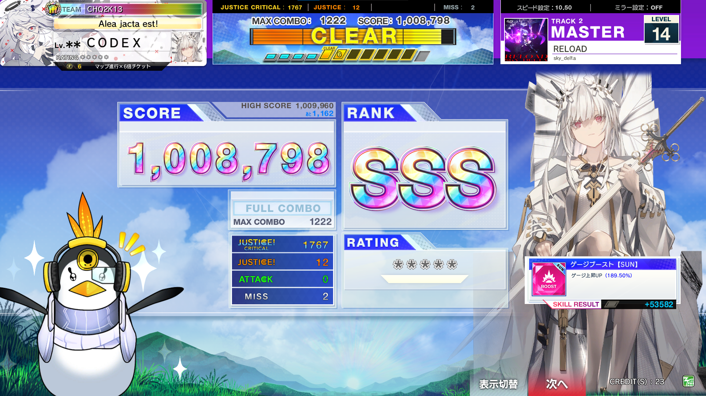

The results screen shares all of the upper elements with the standard gameplay screen.
The score is displayed in the center of the screen, the player's personal high score and difference from that high score is shown above it, and the max combo is displayed underneath the score. To the right of the score, the achieved rank is also displayed following which bracket the score falls under (see [score evaluation](evaluation.md)). Underneath the score, the judgement distribution is shown in addition to **note type** indicators and a **fast/late** indicator. The player's rating is displayed in the bottom right, and if a multiplayer match occurs the score and player cards of the other participating players will also be displayed.

**NEW**: a **judgement breakdown** can be displayed on the results screen. This will display the proportion of each judgement by note type (tap/hold/flick/air) and a Fast/Late bar graph, which may be useful for adjusting offset timing.

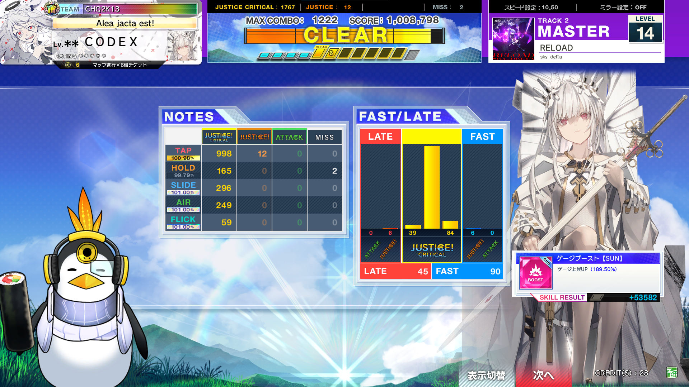

**VERSE**: the results screen now displays the skill clear mark (hard/brave/absolute/etc.) and the various details as well as character rank and EXP gauge. Additionally, [**overpower**](../intermediate/rating.md#overpower-op) gains are displayed; **Hot** overpower is displayed for songs within the latest version folder and **All** overpower is self-explanatory.

If friend scores have been toggled on Chunithm-NET, then their scores will be shown on the detailed results screen in addition to the song select screen.

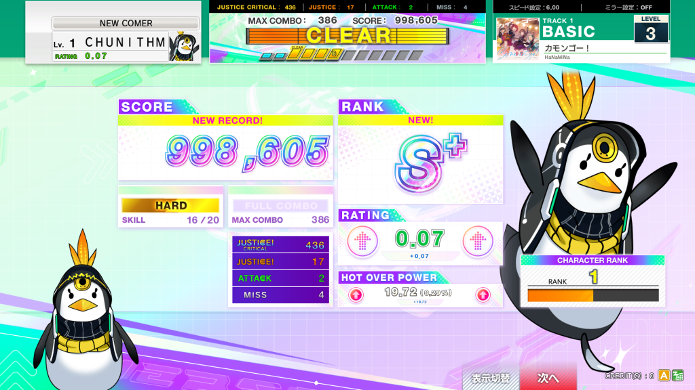
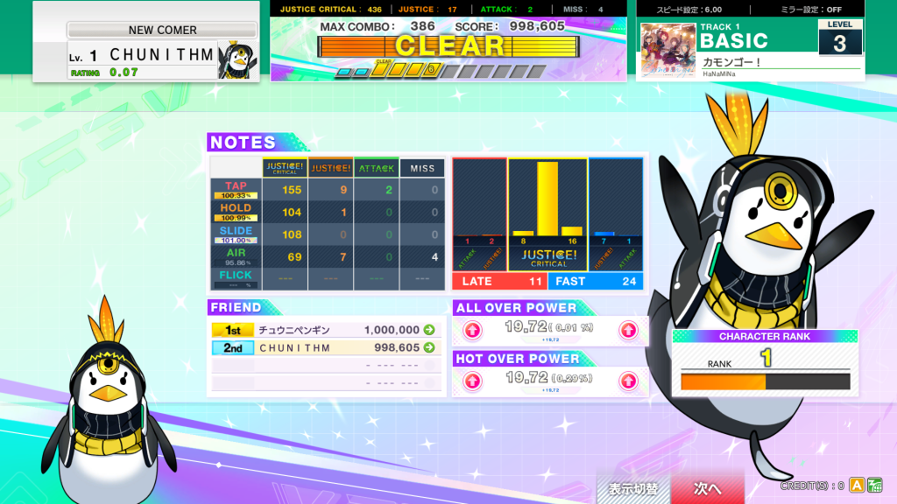
