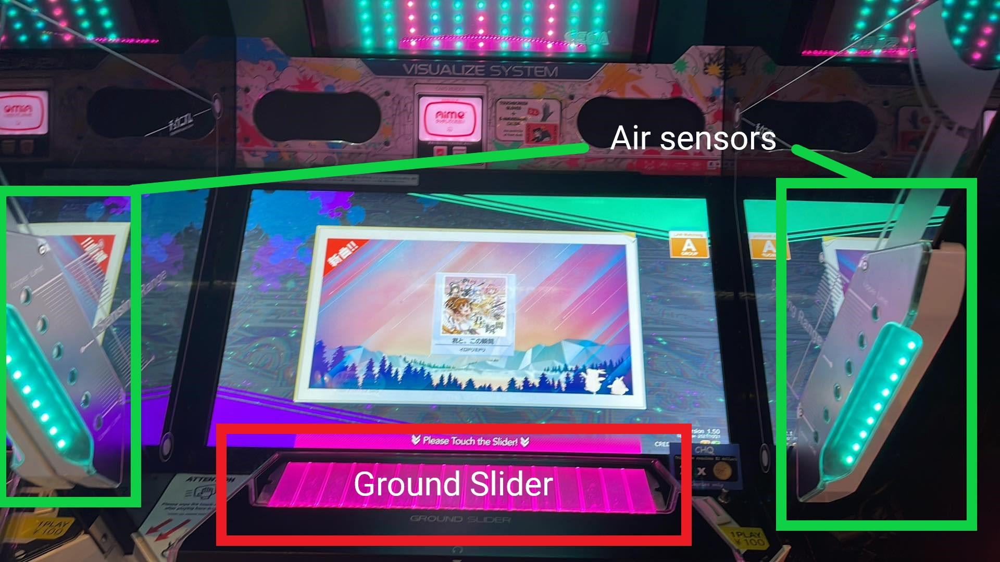

# Introduction

Chunithm (チュウニズム in Japanese) was released by Sega in 2015, and is one of the three pillars of Sega's Performai series of arcade rhythm games, the other two being maimai and O.N.G.E.K.I. New versions of Chunithm are typically released every year, with a “PLUS” iteration every 6 months to add and re-balance charts. Notably, there was a significant hardware upgrade made to the game between Chunithm **PARADISE LOST** and Chunithm **NEW**, the most defining feature being an upgrade from a 60Hz monitor to a 120Hz monitor, but also adding other features such as upgraded panels, speakers, an in-game arena, and customization options.

In Japan, the current version of Chunithm is **VERSE**, released on December 11th, 2024\. This guide contains information on versions starting from Chunithm **PARADISE LOST** to the current version.

Please see the table below for how each version is labeled:

| Version           | Release Date (JP)   |
| ----------------- | ------------------- |
| **PARADISE LOST** | May 13th, 2021      |
| **NEW**           | November 4th, 2021  |
| **NEW+**          | April 14th, 2022    |
| **SUN**           | October 13th, 2022  |
| **SUN+**          | May 11th, 2023      |
| **LUMINOUS**      | December 14th, 2023 |
| **LUMINOUS+**     | June 20th, 2024     |
| **VERSE**         | December 12th, 2024 |
| **VERSE+**        | TBD                 |

## Controls
There are two primary inputs that are relevant to gameplay in Chunithm.

Firstly, there is the **ground slider**, which is a touch-based input device with two rows and sixteen columns of sensors. This works just like most touch devices, like smartphones, and simply touching the slider surface will register as an input in game.

Secondly, there are the **air sensors**, the fins that stick up on each side of the play area. These sense vertical hand or arm movement, which is the main “gimmick” of Chunithm.

Generally speaking, all in-game navigation is done with the touch bar, and the slider regions will light up different colours according to what options are available at any given time, which are also labelled on the bottom part of the screen.
