# Map System

When entering a new set, the game will ask you to first select a map (**PARADISE LOST**: after selecting map mode or course mode). This is Chunithm's meta-progression system, and certain items and charts are locked behind this system. This system is activated after **every chart** played.

| Version            | Photo                                                 | Description                                                                                                                                                                                                                              |
| :----------------- | :---------------------------------------------------- | :--------------------------------------------------------------------------------------------------------------------------------------------------------------------------------------------------------------------------------------- |
| ~**PARADISE LOST** | 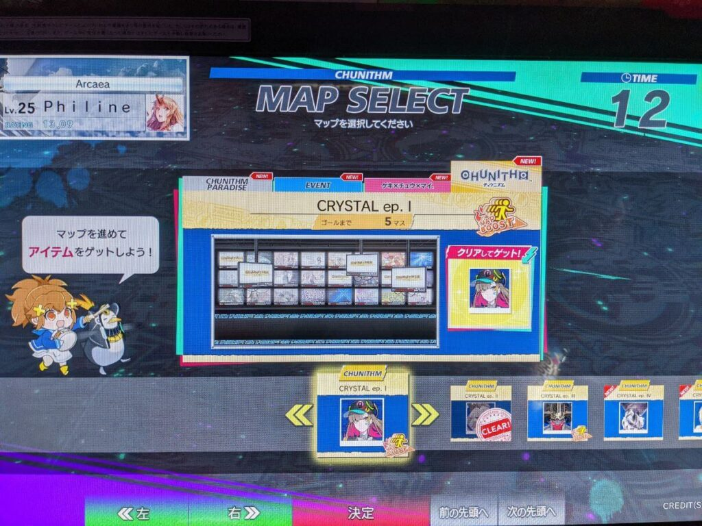 | Each map has a predetermined pathway for unlocking items, only unlocking the first will let you unlock the second, etc. You will only see the first few items as you first start off on a map. Later items are revealed as you progress. |
| **NEW**~           | 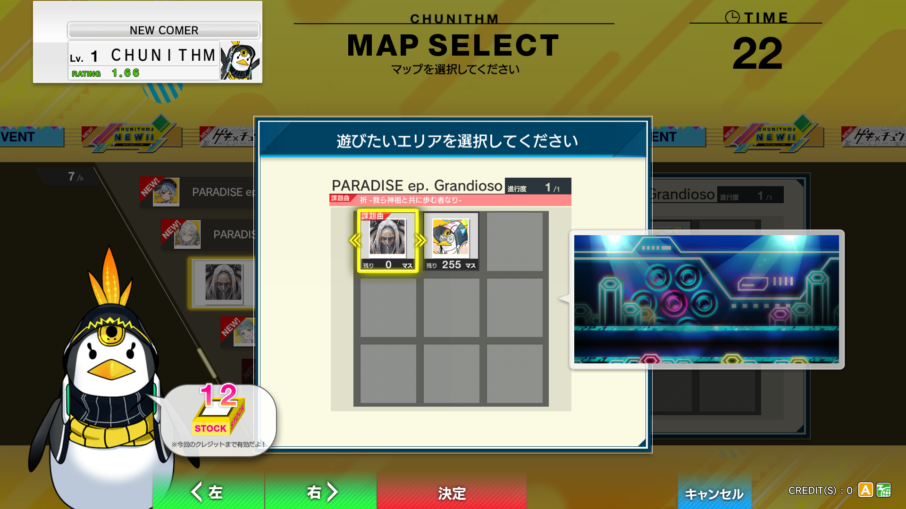             | Each map's items are displayed in a 3x3 grid, and can be unlocked in any given order, so you can prioritize unlocking your favourite characters/items.                                                                                   |

Remember those parallelograms from earlier? Those are how you progress on the maps. The map gauge fills up as you play through the chart, increasing when you hit notes properly and decreasing when you miss or attack. The number of steps filled at the end of the chart will serve as the base number of tiles you will progress. Achieving a Full Combo will add +1 step, and an All Justice will add +2.

Sometimes equipping certain characters or playing specific songs or songs in a specific category will also add additional map tiles. Check the top of your screen in song select for what bonuses are eligible in addition to how many steps remain until the goal.

<figure markdown="1">
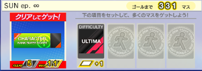
</figure>

**VERSE**: upon completion mid-set, following maps can now be chosen instead of defaulting to the first remaining map. [Details](https://info-chunithm.sega.jp/8930/)

## Missions and Unlocks

Within the map system, a **mission song** (JP: 課題曲, "kadai kyoku") may lie at the end of the map after all steps are traversed. These are typically featured when new events or content updates are released, and sometimes are the only way to unlock songs that are inaccessible in normal play.

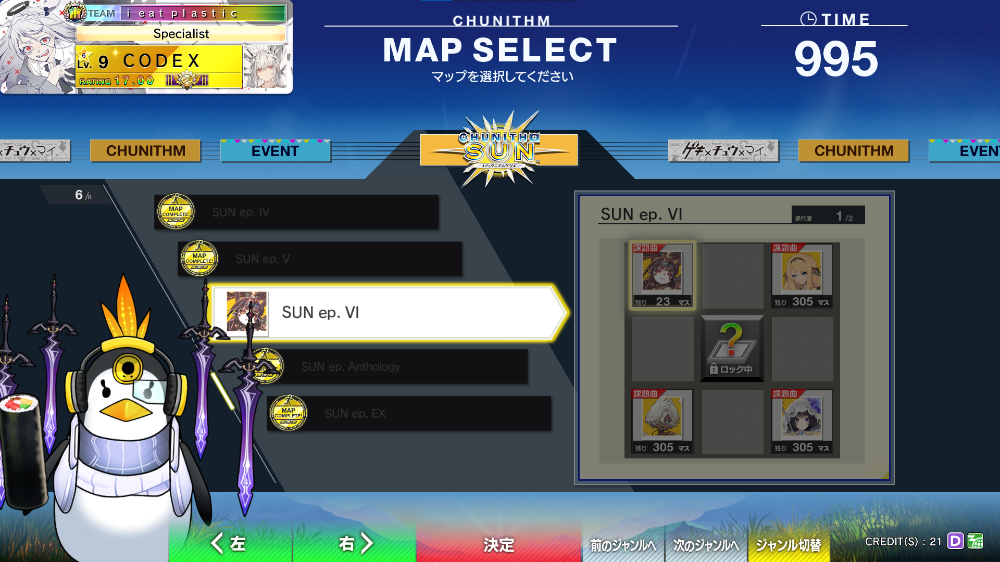

The number of steps required to reach the goal is shown on the map select screen, and if there is a requisite mission song a red mission indicator will be displayed.

When the end of a map that has an attached mission song is reached, the game will display the screen below, notifying you that the mission song is now available to play.

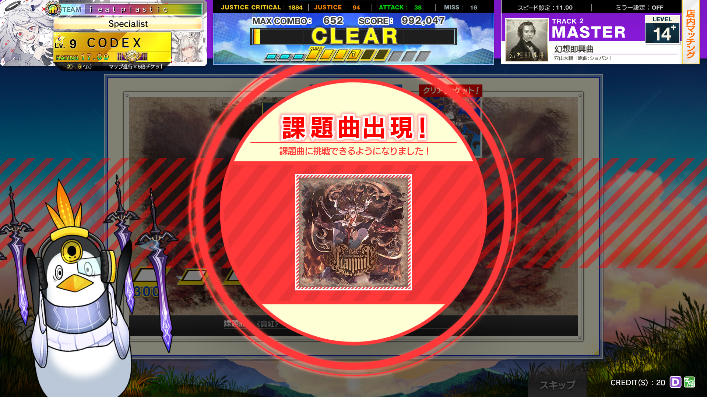

To complete the mission, you must navigate to the **mission song folder**, located to the left of the standard song folders in the song select menu. Once the chart is cleared, it will be added to the standard song list and will be available to play freely.

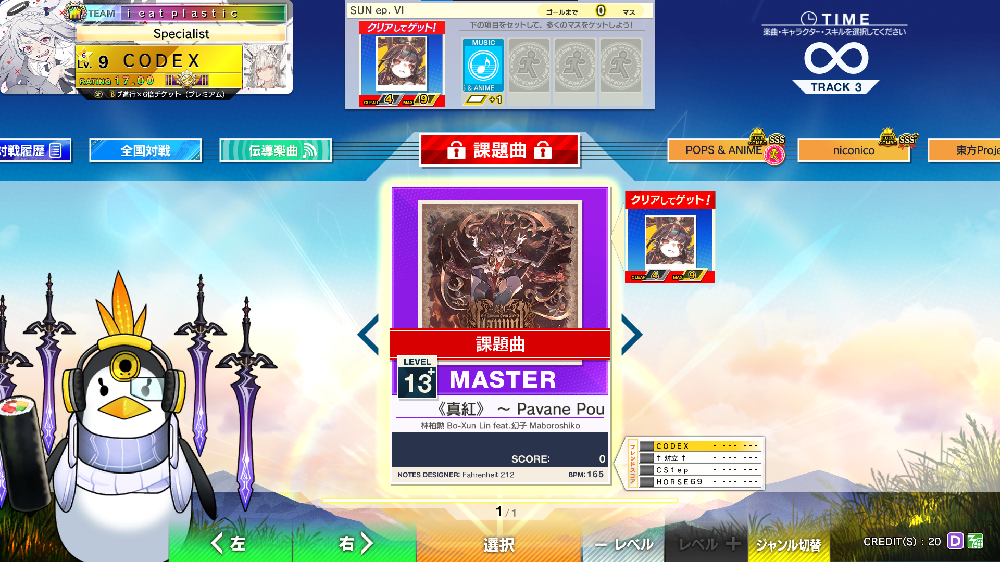

## Tickets

Some tickets will boost the number of map tiles you move, speeding up your progress through them. For example, you can usually pay extra credits to obtain **2x/3x/4x/6x Boost** **Tickets**, which have the handy side effect of unlocking Master difficulty charts in addition to increasing character EXP.

Tickets are **not** **selectable** when the game is on FREE PLAY mode.

| Ticket Name                          | Ticket Appearance                                                                                                                                                                        | Effect                                                                                                                                                                                                                                                                                                                             |
| :----------------------------------- | :--------------------------------------------------------------------------------------------------------------------------------------------------------------------------------------- | :--------------------------------------------------------------------------------------------------------------------------------------------------------------------------------------------------------------------------------------------------------------------------------------------------------------------------------- |
| Character Rank Boost Ticket          | 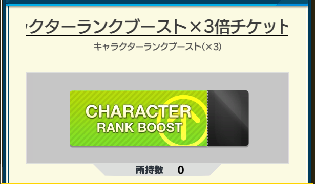                                                                                                                                      | (x3/x6/x9/x12) the character EXP gained after each song in the set.                                                                                                                                                                                                                                                                |
| Master Play Ticket                   | 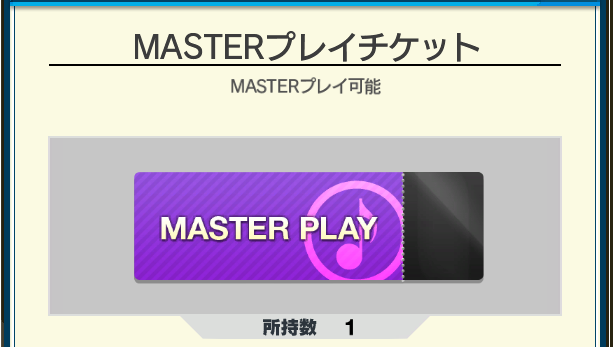                                                                                                                                               | Allows you to play Master difficulty charts without unlocking them (through clearing the Expert difficulty of the same chart).                                                                                                                                                                                                     |
| Ultima Play Ticket (NEW and up)      | 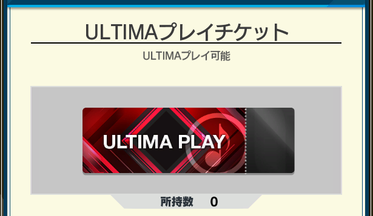                                                                                                                                               | Allows you to play Ultima difficulty charts.                                                                                                                                                                                                                                                                                       |
| WORLD'S END Play Ticket              | 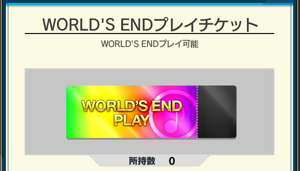                                                                                                                                                   | Allows you to play [WORLD'S END](../intermediate/rating.md#worlds-end) charts.                                                                                                                                                                                                                                                     |
| Map Boost Ticket (2/3/4/6x)          | 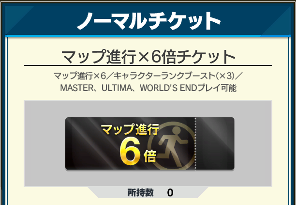                                                                                                                                            | Boosts the steps taken on the map by a specific multiplier, after bonus steps (e.g. from a given character or chart) have been applied. Multiplies character EXP gained by 3x. Additionally, it allows you to play Master, Ultima, and World's End charts. If you can, **use this by default** since it applies all other unlocks. |
| Character EXP Boost Ticket (Premium) | 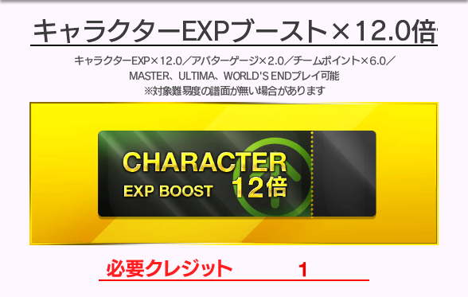                                                                                                                              | (x3/x6/x9/x12) the character EXP gained after each song in the set. Also increases Avatar Gauge and Team Points. Additionally, it allows you to play Master, Ultima, and World's End charts.                                                                                                                                       |
| Character EXP Boost Ticket (Present) | 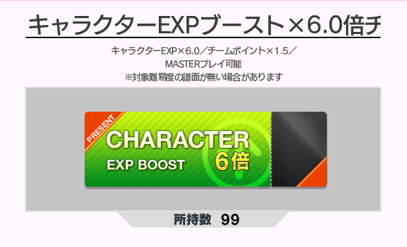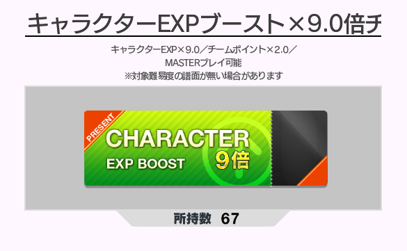 | (x3/x6/x9/x12) the character EXP gained after each song in the set. Also increases Team Points gained and allows you to play Master charts.                                                                                                                                                                                        |
| CHUNITHM-NET Ticket                  | 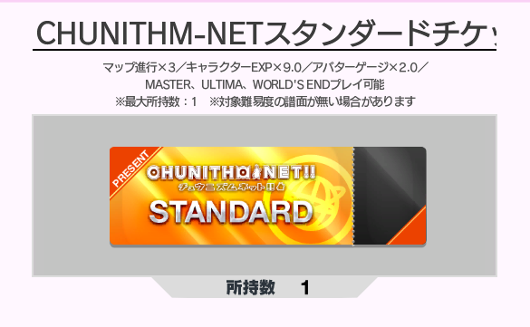                                                                                                                                         | Multiplies the gained character EXP by 9x and map steps by 3x. Additionally, allows you to play Master, Ultima, and World's End charts.                                                                                                                                                                                            |
| EXP Stock Ticket                     | 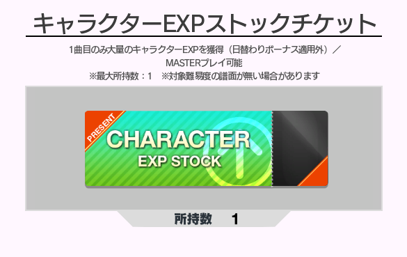                                                                                                                                            | Accumulated by gaining EXP on a character with MAX (capped) level. Will give a very large EXP boost to the equipped character on Track 1 of the credit and allows you to play Master charts. Only 1 of these tickets can be held at a time.                                                                                        |

Deprecated Tickets (~**PARADISE LOST**)

| Ticket Name               | Ticket Appearance                                      | Effect                                                                                                                        |
| :------------------------ | :----------------------------------------------------- | :---------------------------------------------------------------------------------------------------------------------------- |
| Bonus Track Ticket        | 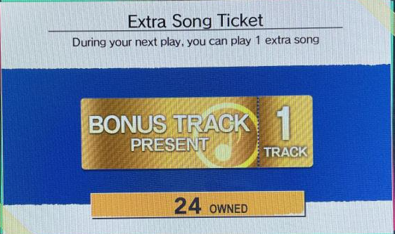        | Given every 5 player levels in **PARADISE LOST**. Allows you to play a 4th track in your set, but does **not** unlock charts. |
| Mission Difficulty Ticket | 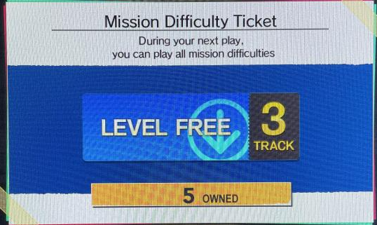 | Allows you to select any difficulty on your next map mission song.                                                            |

!!! mitsuyoshi "Mitsuyoshi Tip!"
    <strong id="mitsuyoshi-3">Use map tickets!</strong>

    Tickets can be rewarded to your account for doing certain tasks or by being redeemed on Chunithm-NET. Who knows, you should cycle through your list and you might just find that you have free **(3/4/5/6)x BOOST** or WORLD'S END tickets :slight_smile:.

## Passing and Failing

"Clearing" in Chunithm, counterintuitively, is not directly tied to how well you actually play the chart. Instead, clearing is tied to the **map system** and not your player score.

This allows funny things to happen like failing while getting a good score (e.g. above SS) on a chart.

<figure markdown="1">
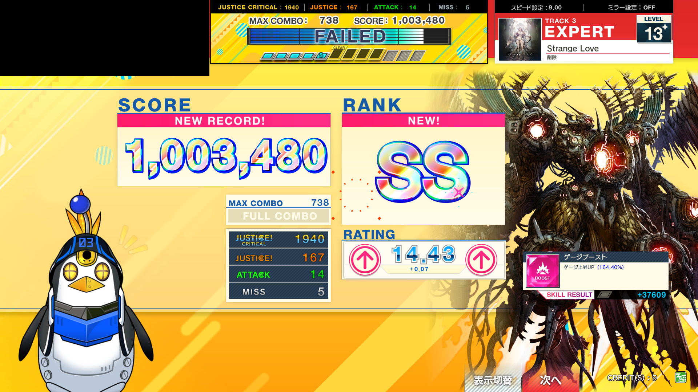
<figcaption>"Wow what a fantastic system :slight_smile:"</figcaption>
</figure>

As such, the ability to "clear" charts is much more dependent on your **character's skill** than your actual player skill. By choosing stronger skills than the default, you will not only clear more consistently but you will also make faster map progress.

!!! mitsuyoshi "Mitsuyoshi Tip!"
    <strong id="mitsuyoshi-4">Strong, efficient character for PLOST</strong>

    In PARADISE LOST, one character's unique skill makes failing all but impossible, and that would be Houjuu Nue (封獣 ぬえ). You can unlock her by completing the **Touhou U.F.O. map** and her unique skill "Unidentified "Terrifying rainbow-colored UFO attack"" is accessible at level 1. Her character art is shown below.

    <figure markdown="1">
    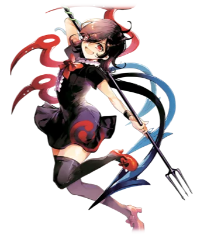
    </figure>
