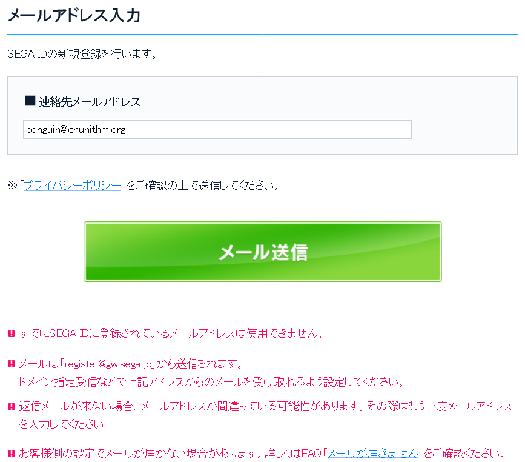
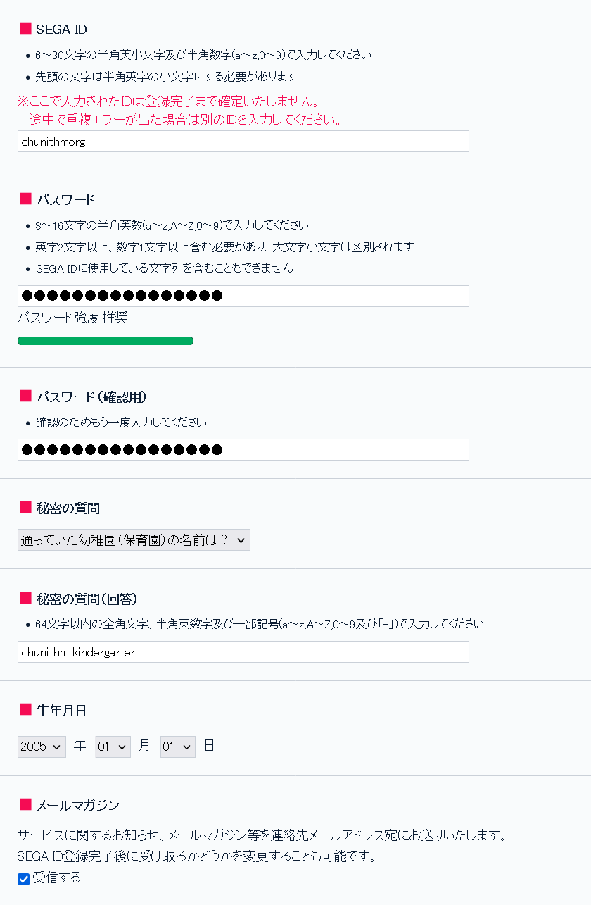
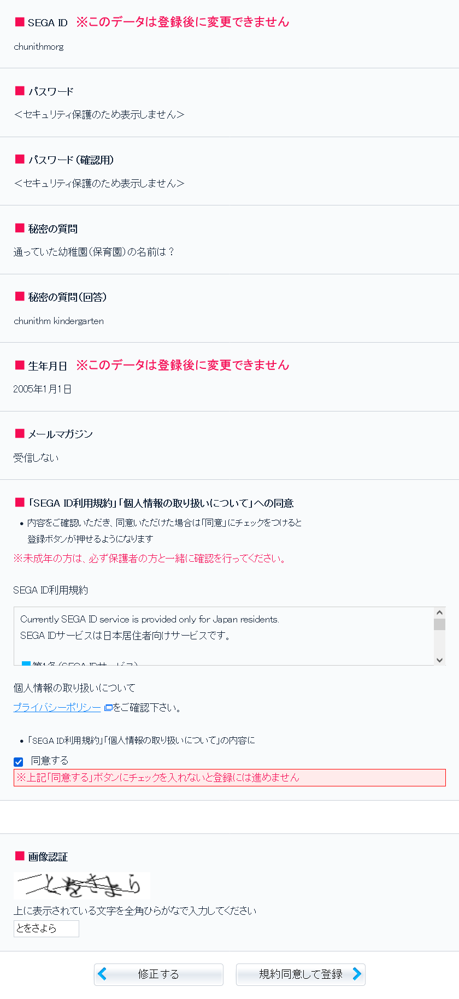

# SEGA ID

Even though it is not necessary to have a SEGA ID to play the game,
creating one gives you access to things like:

- Transferring your data to another card if card is lost or damaged
- Viewing scores
- Customizing settings and cosmetics 

... and many more. 

While you can use social media login (X/Twitter and Facebook) for CHUNITHM
International, the Japanese version strictly requires a SEGA ID.

## Registering a SEGA ID

Go to the [SEGA ID registration page](https://gw.sega.jp/gateway/create/).

### Submitting an email address
On the first page, enter a valid email address (メールアドレス) in the white input
area and then click the green button below to submit your email address.

You should have received a verification email with a link to
`https://gw.sega.jp/gateway/auth/create/setting.html?key=...`. Follow this link
to verify your email address and continue registration.

### Fill in SEGA ID information

Fill in the areas with your information:

- **SEGA ID**: Your SEGA ID username. It must be between 6 and 30 lowercase
alphanumeric (0-9, a-z) characters, and the first character cannot be a number.
- **パスワード (Password)**: Your SEGA ID password. It must be between 8 and 16
alphanumeric (0-9, a-z, A-Z) characters, and must have at least 2 letters and
a number. It cannot be the same as your SEGA ID.
- **パスワード（確認用）(Password confirmation)**: Enter your password again.
- **秘密の質問 (Security question)**: Select one of seven security questions:
    - 通っていた幼稚園（保育園）の名前は？: What was the name of the kindergarten you attended?
    - 生まれた町名は？: What city were you born in?
    - 最初に乗った車の車種は？: What model was your first car?
    - 子供の頃の憧れの選手は？: Who was your sports idol growing up?
    - 初恋の人のファーストネームは？: Who is your first crush?
    - 最初に飼ったペットの名前は？: What is your first pet's name?
    - 中学三年生の時の担任は？: Who was your eighth grade homeroom teacher?
- **秘密の質問（回答）(Security question answer)**: Answer the security question
you selected.
- **生年月日 (Date of birth)**: Select your **year (年)**, **month (月)**
and **day (日)** of birth.
- **メールマガジン (Newsletter)**: Agree to receive email notifications to the address 
you submitted. You can untick the checkbox to not receive them.

Once you're done, select **Next (次へ)** to continue.

### Confirm your information

After you submitted your information, you are given a last check to verify that the
information you entered is correct.

When everything looks good, scroll down to 
**Agreement to "SEGA ID Terms of Use" and "Personal Information Handling"** 
(「SEGA ID利用規約」「個人情報の取り扱いについて」への同意) and tick the checkbox saying
**I agree (同意する)**.

After that, scroll down to **Captcha (画像認証)** and enter the Japanese hiragana
characters in the image. You can use an [online Japanese keyboard](https://www.lexilogos.com/keyboard/hiragana.htm)
to type these, or ask a friend.

Once you have entered the captcha, select
**Agree to terms and conditions and register (規約同意して登録)** to register your
SEGA ID.

### Linking a card to your SEGA ID 

To link a card to your SEGA ID, navigate to the [Aime service site](https://my-aime.net/en/)
and login with your newly-created SEGA ID. The website has an English version, so you 
can take it from here.
