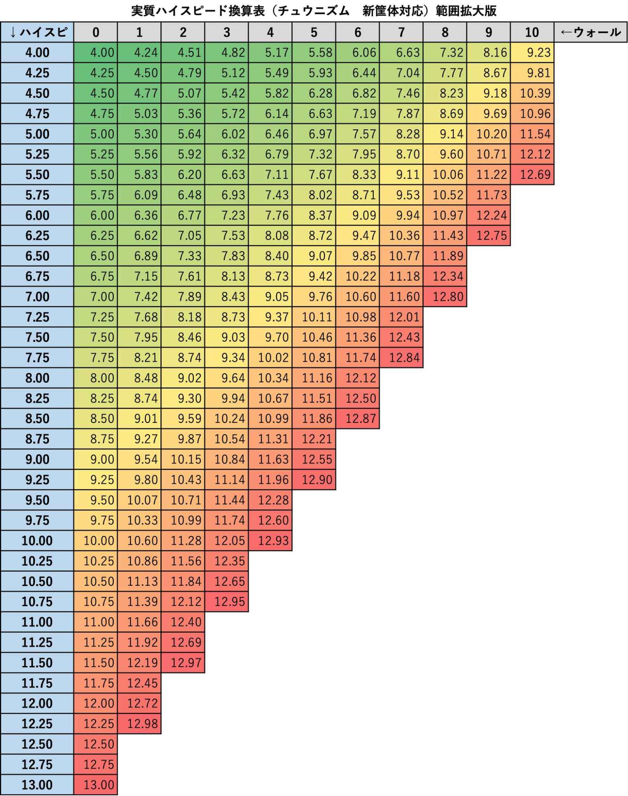

# Settings

Settings, like many other systems, are different pre-**NEW** and post-**NEW**. **Some information here may be inaccurate for Chunithm PARADISE LOST**. Settings are separated into separate tabs where similar options are grouped together (sound, judgement, etc.).

In game, settings can be adjusted in the ‘final check' screen, right after the chart has been selected and right before gameplay begins.

There are three **default** game settings, which loosely correspond to the first three chart difficulty levels in the game (BEGINNER, INTERMEDIATE, ADVANCED). The table below describes the settings dictated by each set, and an explanation of the settings in-depth follows underneath.

| Setting Name                        | BEGINNER | INTERMEDIATE | ADVANCED |
| ----------------------------------- | :------: | :----------: | :------: |
| **Game settings**                   |          |              |          |
| Scroll speed                        |   2.0    |     4.0      |   6.0    |
| Mirror                              |   OFF    |     OFF      |   OFF    |
| Player level display                |    ON    |      ON      |    ON    |
| Rating display                      |    ON    |      ON      |    ON    |
| Overpower                           |   OFF    |     OFF      |   OFF    |
| **Sound settings**                  |          |              |          |
| Guide sound volume                  |   Five   |     Five     |   Five   |
| TAP success sound                   | Default  |   Default    | Default  |
| success sound volume                |   Five   |     Five     |   Five   |
| Skill activation sound volume       |   Five   |     Five     |   Five   |
| **Judgment display setting**        |          |              |          |
| Judgement display position          |  Bottom  |    Bottom    |  Middle  |
| Judgement details display "JUSTICE" |   OFF    |     OFF      |   OFF    |
| Judgement details display "ATTACK"  |   OFF    |     OFF      |   OFF    |
| **Filter settings**                 |          |              |          |
| LEVEL sorting order                 |   OFF    |     OFF      |   OFF    |
| **Background display setting**      |          |              |          |
| Guidelines                          |    2     |      4       |    4     |
| Field brightness                    |    0     |      0       |    0     |
| Field wall                          |    0     |      0       |    0     |
| Field indicator                     |  COMBO   |    COMBO     |  COMBO   |

_Table adapted from [Chunithm wikiwiki](https://wikiwiki.jp/chunithmwiki/%E3%82%B2%E3%83%BC%E3%83%A0%E3%82%B7%E3%82%B9%E3%83%86%E3%83%A01)_.

Beyond presets, the fourth settings option is "Detailed Settings", which allows you to adjust all of the game options below:

| Setting Name   <small>\* New & later \*\* Sun & later \*\*\* Lumi & later</small> | Value (Range)   <small>^ Paradise Lost & before \* New & later \*\* Sun & later</small>                                                                                                 | Explanation                                                                                                                                                                                                                                                                                                                                                                                                                                                                                                                                                                                                                                                                                                                                                                                                   |
| ------------------------------------------------------------------------------------------ | :----------------------------------------------------------------------------------------------------------------------------------------------------------------------------------------------- | ------------------------------------------------------------------------------------------------------------------------------------------------------------------------------------------------------------------------------------------------------------------------------------------------------------------------------------------------------------------------------------------------------------------------------------------------------------------------------------------------------------------------------------------------------------------------------------------------------------------------------------------------------------------------------------------------------------------------------------------------------------------------------------------------------------- |
| **Game Settings**                                                                          |                                                                                                                                                                                                  |                                                                                                                                                                                                                                                                                                                                                                                                                                                                                                                                                                                                                                                                                                                                                                                                               |
| Scroll speed                                                                               | 1.0 – 20.0 (Default 6.0)                                                                                                                                                                      | Adjust the speed at which notes move on the play field. Between speeds 1.00 to 15.00, speed can be increased in increments of 0.50 or 0.25 (ParaLost/New respectively), and between speeds 15.00 to SONIC/20.00, in increments of 1.00. A common scroll speed for MASTER charts is around 8.00.                                                                                                                                                                                                                                                                                                                                                                                                                                                                                                               |
| Mirror                                                                                     | OFF (Default) ON                                                                                                                                                                              | When turned ON, the layout of the chart is horizontally mirrored.                                                                                                                                                                                                                                                                                                                                                                                                                                                                                                                                                                                                                                                                                                                                             |
| Track Skip\*                                                                    | OFF (Default) S S+\* SS SS+\* SSS SSS+\* Personal Best                                                                                     | The song can be force exited when the possible score drops below a specified threshold. This setting is disabled in event mode, class mode, and in-store cab-to-cab matching.                                                                                                                                                                                                                                                                                                                                                                                                                                                                                                                                                                                                                                 |
| Judgement timing A (**Chart** Delay/Offset)                                             | \-2.0 – 2.0 (Default 0.0)                                                                                                                                                                     | Adjust the **position of the chart** with respect to the music. **Can be adjusted in increments of 0.1 from \-2.0 to 2.0** . If there is a lot of FAST: Decrease (-) If there is a lot of LATE: Increase (+) If set (especially ±0.3 or more), it is recommended to set "Guide Sound Volume" in "Sound Settings" to 0.  _Note: for **PARALOST**, this is the ONLY option to adjust offset. There is no Judgement timing B._                                                                                                                                                                                                                                                                                                                                                                 |
| Judgement timing B\*  (**Judgement/input** Delay/Offset)                     | \-2.0 – 2.0 (Default 0.0)                                                                                                                                                                     | Adjust judgement timing without changing the position of the chart for the music. **Can be adjusted in increments of 0.1 from \-2.0 to 2.0**. If there is a lot of FAST: Decrease (-) If there is a lot of LATE: Increase (+) If set (especially ±0.3 or more), it is recommended to set "Guide Sound Volume" in "Sound Settings" to 0.                                                                                                                                                                                                                                                                                                                                                                                                                                                           |
| Matching / Chain Indicator (LUMINOUS+)                                                     | ON (Default) OFF                                                                                                                                                                              | Select whether to enable in-store matching. If it is ON, you can also set whether to display CHAIN. CHAIN ​​will still be added even if you set it to not display CHAIN.                                                                                                                                                                                                                                                                                                                                                                                                                                                                                                                                                                                                                                   |
| Player Level Display                                                                       | OFF ON (Default)                                                                                                                                                                              | Show/hide player level on the nameplate.                                                                                                                                                                                                                                                                                                                                                                                                                                                                                                                                                                                                                                                                                                                                                                      |
| Rating Display                                                                             | OFF ON (Default)                                                                                                                                                                              | Show/hide player rating and course badge/banner on the nameplate. If OFF, rating possession will not be shown on the nameplate.                                                                                                                                                                                                                                                                                                                                                                                                                                                                                                                                                                                                                                                                            |
| Overpower                                                                                  | OFF ON (Default)                                                                                                                                                                              | Show/hide overpower. Does not hide rating possession on the nameplate.                                                                                                                                                                                                                                                                                                                                                                                                                                                                                                                                                                                                                                                                                                                                     |
| **Sound Settings**                                                                         |                                                                                                                                                                                                  |                                                                                                                                                                                                                                                                                                                                                                                                                                                                                                                                                                                                                                                                                                                                                                                                               |
| Guide sound volume (Metronome)                                                             | OFF/0 – 10 (Default 5)                                                                                                                                                                        | A guide sound that plays at the correct timing for each note. This guide sound is bound to the ‘real' chart timing, ignoring offset adjustments.                                                                                                                                                                                                                                                                                                                                                                                                                                                                                                                                                                                                                                                           |
| TAP sound change (Sound font)                                                              | Default Clap Rain Woodblock Bell Kick & Cymbal Short Clap Taiko Maimai Ongeki\*                                                                            | Changes how tap notes sound. A preview of a justice critical judgement is played during selection.                                                                                                                                                                                                                                                                                                                                                                                                                                                                                                                                                                                                                                                                                                            |
| All note volume                                                                            | OFF/0 – 10 CUSTOM (Default 3^ / 5\*)                                                                                                                                 | You can set the following 5 note sound volumes at once. Automatically changes to CUSTOM if below settings are adjusted independently.                                                                                                                                                                                                                                                                                                                                                                                                                                                                                                                                                                                                                                                                         |
| TAP volume                                                                                 | OFF/0 – 10 (Default 3^ / 5\*) {: rowspan=6}                                                                                                                             | Volume for each note type. **Can be set from OFF to 10**. Default is 5. When the above "success sound volume" is changed, it becomes that value.  The HOLD/SLIDE volume is the sound while holding and the end point of HOLD/SLIDE and SLIDE. It refers to the clicking sound that occurs at visible tick points. {: rowspan=5}                                                                                                                                                                                                                                                                                                                                                                                                                                                                   |
| ExTAP volume                                                                               | &#8288 {: style="display: none"}                                                                                                                                                                 | &#8288 {: style="display: none"}                                                                                                                                                                                                                                                                                                                                                                                                                                                                                                                                                                                                                                                                                                                                                                              |
| HOLD/SLIDE volume                                                                          | &#8288 {: style="display: none"}                                                                                                                                                                 | &#8288 {: style="display: none"}                                                                                                                                                                                                                                                                                                                                                                                                                                                                                                                                                                                                                                                                                                                                                                              |
| AIR/AIR-ACTION volume                                                                      | &#8288 {: style="display: none"}                                                                                                                                                                 | &#8288 {: style="display: none"}                                                                                                                                                                                                                                                                                                                                                                                                                                                                                                                                                                                                                                                                                                                                                                              |
| FLICK volume                                                                               | &#8288 {: style="display: none"}                                                                                                                                                                 | &#8288 {: style="display: none"}                                                                                                                                                                                                                                                                                                                                                                                                                                                                                                                                                                                                                                                                                                                                                                              |
| Skill activation volume                                                                    | &#8288 {: style="display: none"}                                                                                                                                                                 | Volume for character skill effects/activation (additional bonus for TARGET skills, decrement for instant death skills, etc.). **Can be set from OFF to 10**. Default is 5.                                                                                                                                                                                                                                                                                                                                                                                                                                                                                                                                                                                                                                 |
| Judgement Sound Trigger\*                                                       | Skill Sound JUSTICE or Less ATTACK or Less MISS or Less                                                                                                                                 | Allows you to choose to play a sound effect (identical to skill activation sound) when judgements of a certain threshold or below is triggered.                                                                                                                                                                                                                                                                                                                                                                                                                                                                                                                                                                                                                                                               |
| **Judgment Display Settings**                                                              |                                                                                                                                                                                                  |                                                                                                                                                                                                                                                                                                                                                                                                                                                                                                                                                                                                                                                                                                                                                                                                               |
| Judgement Display Position                                                                 | Bottom (Default) Medium Top Heaven                                                                                                                                                      | Adjusts the location of judgement indicators on the play field (with a preview). Indicators follow perspective, and are larger towards the bottom and smaller at the top. **Bottom:** Appears below the number in the COMBO display. **Middle:** Appears directly above the "COMBO" characters in the COMBO display. **Top:** Appears slightly above the COMBO display. **Heaven:** Appears slightly above "Top".                                                                                                                                                                                                                                                                                                                                                                                 |
| Judgement Detail Indicator "JUSTICE CRITICAL" / "JUSTICE" / "ATTACK"                    | OFF (Default) ON                                                                                                                                                                              | Allows you to display **FAST/LATE** indicators for JUSTICE CRITICAL/JUSTICE/ATTACK judgements. You can also remove the indicator for the base judgement and only display FAST/LATE for judgements of your choosing.\*                                                                                                                                                                                                                                                                                                                                                                                                                                                                                                                                                                           |
| **Filter/Sort Settings**                                                                   |                                                                                                                                                                                                  |                                                                                                                                                                                                                                                                                                                                                                                                                                                                                                                                                                                                                                                                                                                                                                                                               |
| LEVEL Sorting Order                                                                        | OFF (Default) Ascend. Score Descend. Score                                                                                                                                                 | Allows you to change the sorting order of charts within the LEVEL tab on song select. By default, or in cases of score ties, charts are sorted by difficulty level and then by genre.  LUMINOUS+: deprecated due to advanced sorting options                                                                                                                                                                                                                                                                                                                                                                                                                                                                                                                                                         |
| Character Sorting Order\*\*\*                                                   | Version Name                                                                                                                                                                                  | Changes the order of **collaboration** character categories on the character selection screen. (The order of the Touhou Project, maimai, Ongeki, Irodorimidori, and original character categories will not change.)                                                                                                                                                                                                                                                                                                                                                                                                                                                                                                                                                                                        |
| **Background Display Settings**                                                            |                                                                                                                                                                                                  |                                                                                                                                                                                                                                                                                                                                                                                                                                                                                                                                                                                                                                                                                                                                                                                                               |
| Guidelines                                                                                 | OFF 2-Split 4-Split (Default) 8-Split 16-Split                                                                                                                                       | Changes number of field divisions (vertical). Preview available.                                                                                                                                                                                                                                                                                                                                                                                                                                                                                                                                                                                                                                                                                                                                              |
| Field Brightness                                                                           | \-5 – 0 (Default 0)                                                                                                                                                                           | Adjusts the brightness of the play field. Preview available.                                                                                                                                                                                                                                                                                                                                                                                                                                                                                                                                                                                                                                                                                                                                                  |
| Field wall                                                                                 | 0 – 16 (Default 0)                                                                                                                                                                            | Displays a wall that obscures notes at the back of the play field. Similar to beatmaniaIIDX's "SUDDEN+". Preview available. At 15, only the judgement line is visible, and at 16, nothing is visible.                                                                                                                                                                                                                                                                                                                                                                                                                                                                                                                                                                                                         |
| Field Indicator                                                                            | OFF COMBO SCORE (+ Type) SCORE (- Type) Border S Border S+\* Border SS Border SS+\* Border SSS Border SSS+\* Border Personal Best | Adjusts the score information displayed on the play field above COMBO (when playing solo) and CHAIN ​​(when matching). Preview available.  **OFF:** Clears all COMBO/CHAIN ​​displays. **COMBO:** Only COMBO is displayed when soloing, and COMBO is displayed above CHAIN ​​when matching. **SCORE (+ type):** Additive score, increases when notes are hit, identical to the score indicator on the top of the screen. **SCORE (-type):** Deductive score. Starts at 1,010,000 and assumes that all future notes are JUSTICE CRITICAL. Subtracts score from the total for judgements JUSTICE or below. **Border/(S・S+・SS・SS+・SSS・SSS+・Personal best)**: Displays the difference from the target score in SCORE (- type) format. The display disappears when it becomes unreachable. |

_Table adapted from [Chunithm wikiwiki](https://wikiwiki.jp/chunithmwiki/%E3%82%B2%E3%83%BC%E3%83%A0%E3%82%B7%E3%82%B9%E3%83%86%E3%83%A01)_.

## Tips for Adjusting Offset

TL;DR:

- Adjust **Offset A** until it feels like the notes **arrive at the judgement line in time with the music**, THEN
- Adjust **Offset B** until your **judgement distribution becomes centered**

Detailed explanation:

Finding a proper offset to play at is a common process when adjusting to a new rhythm game. The purpose of adjusting offset is to change the timing and judgements of a given rhythm game to something that feels "on time" to the player, which is a subjective determination and can end up being very different across different players.

Additionally, terminology surrounding types of offset may not be interpreted the same by all players. This guide will follow the definitions in Tokaku's [_Do you hit ON the line or ABOVE the line?_](https://www.youtube.com/watch?v=JWj98KJVuAQ) video. Additionally, a good explanation is given in donmai's article on [GekiChuMai Timing Windows and Offsets](https://listed.to/@donmai/41511/gekichumai-timing-windows-and-offsets).

**NEW~**: both **Judgement Timing A** (chart) and **Judgement Timing B** (judgement/input) are adjustable. The way I perceive the difference is as follows:

- Judgement Timing A will shift the _position_ of the notes on the play field up or down, so that the notes hit the judgement line earlier or later.
- Judgement Timing B will shift the _judgement timing_ of the notes so that the entire judgement breakdown/distribution shifts earlier or later, irrespective of the position of the notes.

As such, I would follow the following method to calibrate offset:

1. Find a song and chart that is familiar and comfortable to play. You should be able to hit nearly every note in the chart, but ensure it has some amount of pattern complexity to use as a benchmark.
2. Are the notes disappearing on the center of the judgement line in time with the audio?
   1. If yes, then proceed straight to step 3.
   2. If not, then adjust **Judgement Offset A**. _**Ignore all judgement feedback when you are adjusting Offset A**_ (you can remove judgement indicators in settings during this step).
      1. If you perceive that you have to hit **above** the judgement line to be on time with the song, **decrease** (-) Judgement Timing A until the notes align with the judgement line.
      2. If you perceive that you have to hit **below** the judgement line to be on time with the song, **increase** (+) Judgement Timing A until the notes align with the judgement line.
3. Once Offset A is set, play the benchmark chart and press the _DETAILS_ button on the score results screen to bring up the **judgement distribution**.
   1. If there are more **fast** notes, **decrease** (-) Judgement Timing B by 0.1-0.2.
   2. If there are more **late** notes, **increase** (+) Judgement Timing B by 0.1-0.2.
   3. Repeat the above step until the fast/late distribution is roughly equal.

??? Legacy Offset (~**PARADISE LOST**)

   **~PARADISE LOST**: only **Judgement Timing A** (chart offset) is adjustable as outlined in the settings table above. This is less than ideal, as players that time based on the audio of the song don't have a fine option to tune offset. I would follow this method to determine an optimal offset:

   1. Find a song and chart that is **familiar** and **easy** to play. You should be able to hit nearly every note in the chart, but ensure it has some amount of pattern complexity to use as a benchmark.
   2. Note the **Fast/Late** distribution of the benchmark chart on the results screen.
      1. If there are more **fast** notes, **decrease** (-) offset by 0.1-0.2.
      2. If there are more **late** notes, **increase** (+) offset by 0.1-0.2.
   3. Repeat steps 1-2 until the fast/late distribution is roughly equal.

One final note about offset is that the **scroll speed** and **field wall** can also be used as a tool to subjectively adjust the timing of notes. From personal experience, increasing the scroll speed shifts the fast/late distribution away from the fast side.

!!! mitsuyoshi "Mitsuyoshi Tip!"
    <strong id="mitsuyoshi-6">Field wall detailed table</strong>

    A table that displays the effective speed of various scroll speed + field wall combinations can be found below [(original account removed)](https://fxtwitter.com/shirohara_64qam/status/1743965181267587559?t=5_YH1k3iF6hnB8NIXHqxbQ&s=19).

    
