# Rating and Meta-Progression

After playing your first few credits of the game, you might find yourself asking: "That was fun, but how do I get better?"

As you've probably noticed, your player card displays a rating, which is a numerical approximation of your skill. In general, setting higher scores on higher difficulty maps will increase the rating value. However, the system is quite deep and requires some explanation to fully understand.

## Rank/Colour

The colour of the rating is dependent on which rating bracket it falls into.

| **Rating**     | **Colour**  |
| 0.00 to 3.99   | Green       |
| 4.00 to 6.99   | Orange      |
| 7.00 to 9.99   | Red         |
| 10.00 to 11.99 | Purple      |
| 12.00 to 13.24 | Bronze      |
| 13.25 to 14.49 | Silver      |
| 14.50 to 15.24 | Gold        |
| 15.25 to 15.99 | Platinum    |
| 16.00+         | **Rainbow** |

??? Legacy Rating (~**PARADISE LOST**)

    | ~PARADISE LOST |             |
    | :------------- | :---------- |
    | **Rating**     | **Colour**  |
    | 0.00 to 3.99   | Green       |
    | 4.00 to 6.99   | Orange      |
    | 7.00 to 9.99   | Red         |
    | 10.00 to 11.99 | Purple      |
    | 12.00 to 12.99 | Bronze      |
    | 13.00 to 13.99 | Silver      |
    | 14.00 to 14.49 | Gold        |
    | 14.50 to 14.99 | Platinum    |
    | 15.00+         | **Rainbow** |

**VERSE**: rating intervals of 0.25 past **Platinum** are recognized with stars.

| Rating | Rank                                                                                           |
| :----- | :--------------------------------------------------------------------------------------------- |
| 16.00  | Rainbow (★) 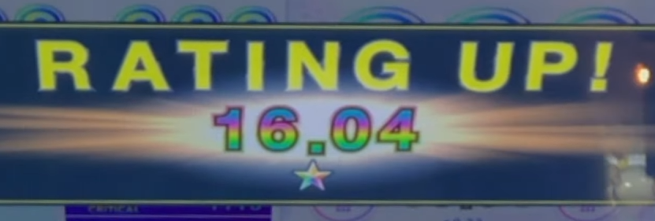{: style="width: 200px"}              |
| 16.25  | Rainbow (★★) 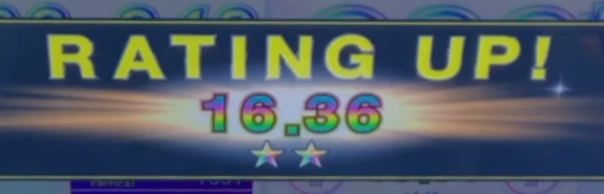{: style="width: 200px"}             |
| 16.50  | Rainbow (★★★) 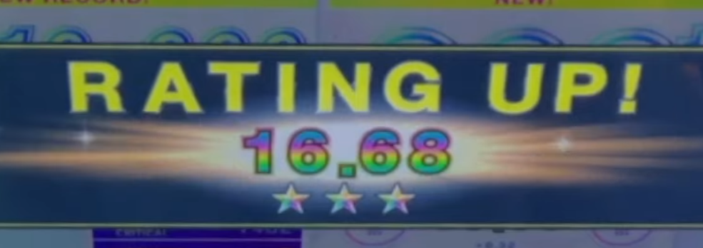{: style="width: 200px"}            |
| 16.75  | Rainbow (★★★★) 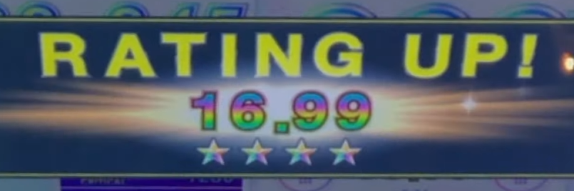{: style="width: 200px"}           |
| 17.00  | Rainbow (極, "Kiwami") 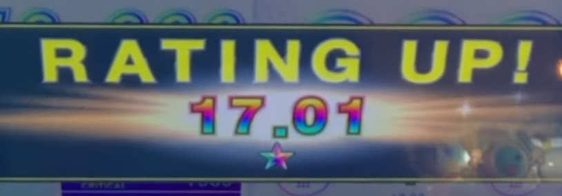{: style="width: 200px"} |

## Rating Formula (VERSE~)

**VERSE**: the recents folder has been **removed**. Instead, rating is composed of a "new songs" folder alongside the existing "best rated scores" folder, similar to maimaiDX.

Rating is now measured across **50 charts** in total. You can no longer have your rating drop at any point during the active version, although players can expect their rating to drop upon the next version of the game (Chunithm VERSE PLUS).

The player rating formula is split up into two components:

| Top 30 all-time scores | \+  | 20 high scores from current version |
| :--------------------: | :-: | :---------------------------------: |
|   aka "Best 30/B30"    |     |          aka "New 20/N20"           |

All individual charts must be **unique** across all rating charts. In other words, a high score on a chart that would contribute to your B50 would only count once.

The amount of **rating** gained for charts is dependent on two variables: the **chart constant** and the **score** achieved on the chart.

The table below illustrated how much rating is gained at each rank threshold:

| Rank             | Score     | Rating value              |
| ---------------- | --------- | ------------------------- |
| SSS+1 | 1,009,000 | Chart constant \+2.15     |
| SSS              | 1,007,500 | Chart constant \+2.0      |
| SS+              | 1,005,000 | Chart constant \+1.5      |
| SS               | 1,000,000 | Chart constant \+ 1.0     |
| S                | 975,000   | Chart constant (+ 0\)     |
| AA               | 925,000   | Chart constant \- 3.0     |
| A                | 900,000   | Chart constant \- 5.0     |
| BBB              | 800,000   | (Chart constant \- 5.0)/2 |
| C                | 500,000   | 0                         |

_1Note: The SSS+ bonus interval, similar to other \+ intervals, is only in Chunithm NEW and later ([Score Evaluation](../basic/evaluation.md)); the cap for PARADISE LOST is \+2.0._

Scores that lie in between these thresholds are **interpolated**, see the "Gaining Rating" section below.

??? Legacy Rating Formula (~LUMINOUS+)

    The **player rating formula** is split up into two components:

    | Top 30 all-time scores | \+  | Recent 10 high scores |
    | :--------------------: | :-: | :-------------------: |
    |   aka "Best 30/B30"    |     |     aka "Recents"     |

    An example is shown below (source: [Chunithm Rating Calculator](https://docs.google.com/spreadsheets/d/1TT3-89PqcTvyL_nMbnGxL2q5bg5pLtHiKg_qStSJ88M/edit#gid=824923779)):
    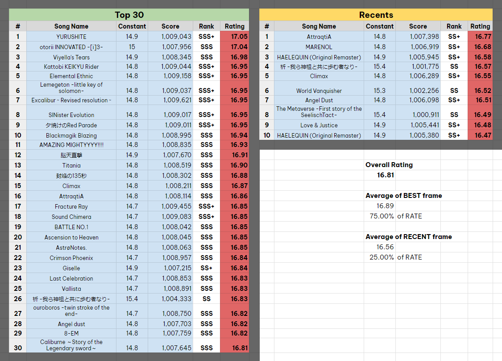

    Charts in the **Top 30** must be unique (only one entry per chart). You may have two difficulties of the same song in the Top 30, but not the same difficulty. Charts in **Recents** are not held to any such restrictions and as such you may fill the Recents section with multiple plays of the same chart. Recents are taken from the last **30** charts played and will be displaced either once a score with a higher rating is achieved or 30 new charts have replaced the pool.

    !!! mitsuyoshi "Mitsuyoshi Tip!"
        <strong id="mitsuyoshi-7">SSS "Rating Guard"</strong>

        Another factor in the recents rule is that scores of rank SSS or above (of any difficulty) will **not** displace the recent 10, instead pushing out the oldest chart amongst the remaining 20 in the recents pool. This is why you usually do not drop rating on SSS scores as the developers anticipated it wouldn't be very player friendly. As soon as a non-SSS score is achieved, the normal rules apply and the oldest chart in recent 10 is displaced. Exceptions are possible.

## Gaining Rating

The maximum possible rating you can get from a chart is the **chart constant +2.15**, so any additional score after 1,009,000 no longer contributes to your rating. Let's examine how much rating you gain at each interval, shall we?

| Rank | Score                  | Rate of increase               |
| ---- | ---------------------- | ------------------------------ |
| SSS+ | 1,009,000 ~            | 0                              |
| SSS  | 1,007,500 to 1,008,999 | +0.01 for every 100 points     |
| SS+  | 1,005,000 to 1,007,499 | +0.1 for every **500** points  |
| SS   | 1,000,000 to 1,004,999 | +0.1 for every **1000** points |
| S+   | 990,000 to 999,999     | +0.1 for every 2500 points     |
| S.   | 975,000 to 989,999     | +0.1 for every 2500 points     |

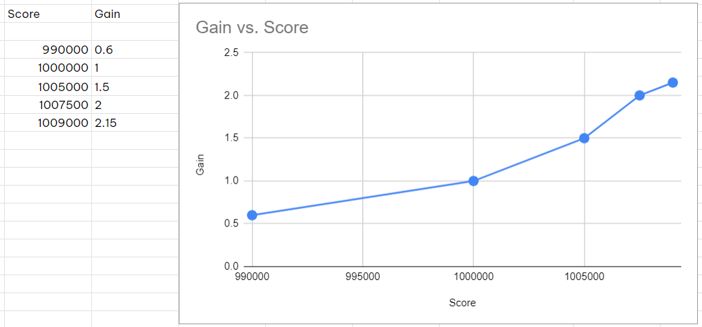

We can see from this table that rating increases linearly up to SS rank, where the rate at which rating is gained jumps by 2.5x. If we look at the interval between SS+ and SSS, the rate jumps yet again to 5x! This shows that the **highest value** interval to target for gaining rating from charts is **SS+ to SSS**. As such, I highly recommend **aiming for SSS rank** when trying to improve at the game. Not only does this contribute the largest amount of rating, but by being more deliberate with your play and fully understanding patterns, you will improve at a faster pace and avoid building bad habits.

## Skill Floor, Skill Ceiling/Pull-Run-Push

_aka how to structure your play sessions_

I suggest taking a balanced approach to develop a more well-rounded skillset. In my opinion, you should primarily focus on **playing charts that you can SS+/SSS** (as stated above, since that's where most rating gain occurs). A quick benchmark to determine what level that is to take your peak rating, subtract 2, then round it to the nearest 0.5; that will roughly determine what level your "run" level is at.

_E.g. Player rating of 14.9 > 14.9 - 2 = 12.9 > round up 12.9 to 13; primarily play around level 13_

You should also take some time occasionally to play charts that are a level or two **underneath** your standard difficulty range and aim for SSS+ or All Justice to increase your **skill floor**, and similarly sometimes play charts that are a level **higher** than your standard difficulty to increase your **skill ceiling**. This balance of playing charts across a spectrum of difficulty with different goals is also referred to as **pull-run-push**.

Improving your skill floor (aka "playing lowers") is important in order to develop more accurate timing and solidify fundamental patterns. Nearly every single chart in the game has something to teach you, even if you aren't feeling challenged for the majority of the chart. The more you do this, the easier it becomes to eventually get All Justice on higher difficulties.

Improving your skill ceiling (aka "skill pushing", "playing uppers") is also good in moderation to expose you to new patterns that you haven't seen and give you a taste of what lies ahead in the game. Most players would agree that the really fun charts are confined largely to higher difficulties, as that's where chart creators can throw in more demanding patterns, homages to other charts, and chart-specific tech that will take you by surprise on sightread.

This theory is expanded upon in the [_Mentality for Improvement in Rhythm Games_](https://docs.google.com/document/d/1gwuauPmfOTm99oOQlbZLBDRdIHUHi0Mnz3UW3hImmNc/edit) article written by 8por?:

"_In order to prevent burnout and maintain interest, it's best to keep a balance of pushing the skill floor and skill ceiling. An proven effective pattern is pull-run-push cycle, which includes warming up/pulling the floor → solidifying skill by playing at the optimal difficuly level → pushing the ceiling. It's recommended to plan your sessions around this pattern._" \- 8por?

As an example of what this looks like in a play session, I'd suggest playing 1-2 sets of lower difficulty charts to warm up followed by a mix of standard difficulty charts with some upper difficulty charts thrown in. For instance, for a 15.1 rated player (gold rating), consider the following:

- Set 1: 12 > 12 > 12+
- Set 2: 12 > 12+ > 12+
- Set 3: 13 > 13+ > 13
- Set 4: 13+ > 13 > 14
- Set 5: 13 > 13+ > 14

This article with the same name ([_Skill Floor, Skill Ceiling_](https://iidx.org/theory/skill_ceiling_floor)) written by Horie is a fantastic reference that expands upon this idea in more detail despite being written for beatmania iidx.

!!! mitsuyoshi "Mitsuyoshi Tip!"
    <strong id="mitsuyoshi-8">A comprehensive-ish set of goals to improve at all stages of progression</strong>

    "Help! There's too much information to follow. Can you just give me a discrete set of goals to work on at \[insert rating here\]?"

    In fact, I can! I've put together a mix of progression goals and task chart with fellow Chunithm player underjoy, and you can find it in the [Kamaitachi Chunithm Questline Tracker](https://chunithm.org/quests). It was designed to help players develop mastery and become well-rounded at all areas of the game, and it should provide an ample challenge to those seeking one.

# Other Gamemodes

## Class Certification/Course Mode

Course mode is a mode where you play three predetermined or random charts in a row with a restriction on how much you can mess up. For example, a course may give you 100 "life", but each attack will deduct 1 life and each miss will deduct 2 life. Different courses will have different judgements and conditions. You pass the course by making it to the end and staying alive, upon which a **class badge** of the corresponding difficulty is added to your player card.

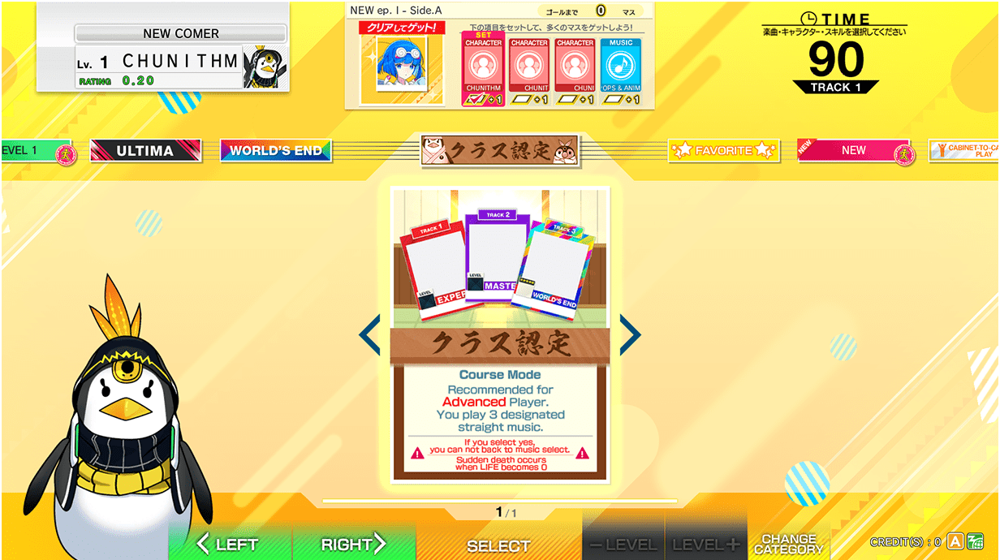

Courses are split up into difficulty by classes, ranging from I (one) to V (five) with the addition of class INF. These courses increase in difficulty, with class V courses demanding you to survive through a combination of 13+ and 14 charts (brutal). By clearing **all** courses within a difficulty, you will receive a **class banner/emblem**, which will appear behind your class badge.

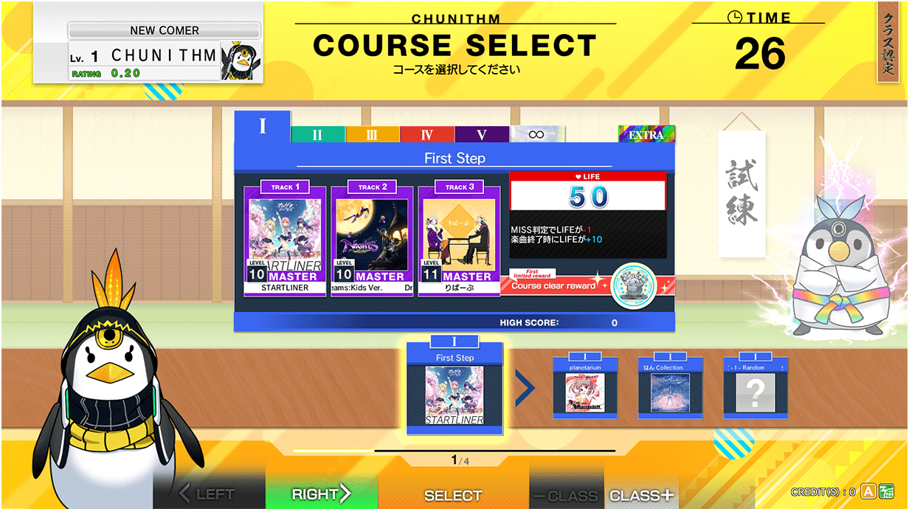

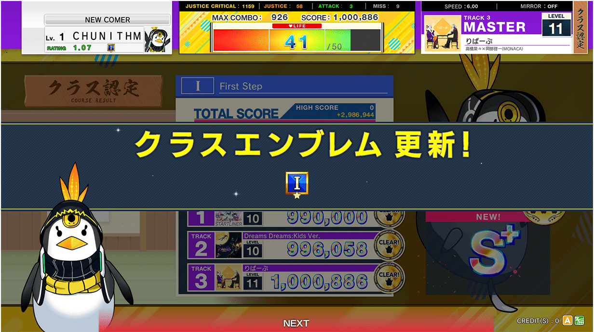

**PARADISE LOST**: course mode is accessed at the **beginning** of the set, right after login. You must commit to playing a full course or instead choosing a map and beginning standard play.

**NEW**: course mode is accessed **within song select**. However, it is only accessible before the first song is played and will be greyed out on track 2 and beyond.

## World's End

World's End charts are an entirely separate set of charts that have wacky mechanics, such as making all of the notes tiny, making all of the patterns way more dense, adding in damage notes, and more. The difficulty number is replaced with a specific Japanese kanji character and a number of stars from 1-5 to distinguish what kind of gimmick will feature in the chart. They do not affect your rating and are a "for fun" mode, although some of them make an appearance in the INF class courses.

World’s End charts require a **ticket** to play.

A list of World's End Markings are given below:

| Kanji                            | Mechanic      | Description                                                                                                                                                                                                                                                                                                                                    |
| :------------------------------- | :------------ | :--------------------------------------------------------------------------------------------------------------------------------------------------------------------------------------------------------------------------------------------------------------------------------------------------------------------------------------------- |
| **Standard Markings**            |               |                                                                                                                                                                                                                                                                                                                                                |
| 割                               | Division      | Usually the same as normal charts but all the notes are split into the smallest possible notes while retaining the original size.                                                                                                                                                                                                              |
| 半                               | Half          | All notes are half the width and the chart only takes up the middle two fourths of the playing field.                                                                                                                                                                                                                                          |
| 狂                               | Insanity      | Charts are very hard with lots of notes, often very tiring.                                                                                                                                                                                                                                                                                    |
| 跳                               | Hop           | Most, if not all of the notes in these charts are AIR notes.                                                                                                                                                                                                                                                                                   |
| 翔                               | Soar          | Similar to "Hop", but with AIR-HOLD and AIR-SLIDEs throughout the chart. Can be considered a derivative type.                                                                                                                                                                                                                                  |
| 両                               | Dual          | A derivative of 半, where the chart is split down the middle and each side is treated as its own chart. If played normally, players may find themselves running out of fingers or hands. Can be played by two players cooperatively, one taking each half of the slider. The difficulty of each side is sometimes suggested in NOTES DESIGNER. |
| 敷                               | Cover         | Contains extended HOLD and SLIDE notes.                                                                                                                                                                                                                                                                                                        |
| 避                               | Evasion       | Charts contain SHOCK notes.                                                                                                                                                                                                                                                                                                                    |
| 弾                               | Bounce/Spring | There are significantly more SLIDE notes in these charts.                                                                                                                                                                                                                                                                                      |
| 光                               | Light         | There are significantly more ExTAP notes.                                                                                                                                                                                                                                                                                                      |
| 布                               | Cloth         | Usually require you to turn your hands.                                                                                                                                                                                                                                                                                                        |
| 覚                               | Memorization  | You need to be able to remember patterns and repeat them. These charts often will provide a sample of a pattern, and will repeat the pattern as a sort of memory quiz.                                                                                                                                                                         |
| 戻                               | Reversion     | Charts will not only go forwards, but go backwards as well.                                                                                                                                                                                                                                                                                    |
| 速                               | Speed         | Contains speed changes in different parts of the chart.                                                                                                                                                                                                                                                                                        |
| 止                               | Halt          | Contains sudden stops in certain parts of the chart.                                                                                                                                                                                                                                                                                           |
| 時                               | Time          | Similar to 止 (Halt), but there are notes that you have to hit during the stop portions.                                                                                                                                                                                                                                                       |
| 歌                               | Song          | Some of the notes are shaped into Japanese characters which reference the lyrics of the song.                                                                                                                                                                                                                                                  |
| 改                               | Reform        | World's End exclusive song of the original series.                                                                                                                                                                                                                                                                                             |
| 分                               | Distinguish   | Course mode exclusive marking. Randomly selects a chart from multiple options upon reaching the corresponding track.                                                                                                                                                                                                                           |
| **Unique Markings**              |               |                                                                                                                                                                                                                                                                                                                                                |
| ！                               |               | Two types, either: 1\. Avoiding Game \- a mixture of 避 (Evasion) and 敷 (Cover), where you must avoid damage notes while performing and endless HOLD/SLIDE (think Touhou and bullet hell games), and 2\. Anything else that does not fall into any other category.                                                                            |
| ？                               |               | Two types, either: 1\. Passing Notes \- Individual notes can have different speed values, and notes can even have negative speed values (causing them to appear from the front), and 2\. Freedom \- Charts that combine multiple attributes.                                                                                                   |
| **Other Game Related Markings**  |               |                                                                                                                                                                                                                                                                                                                                                |
| 蔵                               | Shelved       | In Maimai, the "Banquet Hall/Utage" (World's End charts in Maimai) were halfway produced, and stopped; sometimes referred to as ‘beta' charts. These charts don't have any elements specific to World's End charts.                                                                                                                            |
| 舞                               | Dance         | The way this character is pronounced is "Mai", a reference to Maimai. Exclusive kanji for Maimai songs.                                                                                                                                                                                                                                        |
| 撃                               | Attack        | "Geki", references the corresponding Ongeki chart. ExTAPs are bells, FLICKs are flicks, damage notes are bullets etc.                                                                                                                                                                                                                          |
| 招                               | Invite        | Makes references to the original game/media where the song came from.                                                                                                                                                                                                                                                                          |
| **April Fools Related Markings** |               |                                                                                                                                                                                                                                                                                                                                                |
| 嘘                               | Lie           | Exclusive kanji for April Fools charts from April 1 to the next Wednesday after Sunday.                                                                                                                                                                                                                                                        |
| 謎                               | Mystery       | Exclusive kanji for the April Fools song "怒槌～光吉猛修一部谜～"                                                                                                                                                                                                                                                                              |

Credit to @axelparkster on discord for English definitions.

For more information about World's End charts, check the JP [wiki](https://gamerch.com/chunithm/entry/487368).

## Online Battle

Online Battle (全国対戦) was introduced in **NEW**, and is a matchmaking mode where up to 4 players are placed in lobbies against other players of similar skill level and compete against each other across 4 songs; each player picks their own chart. 

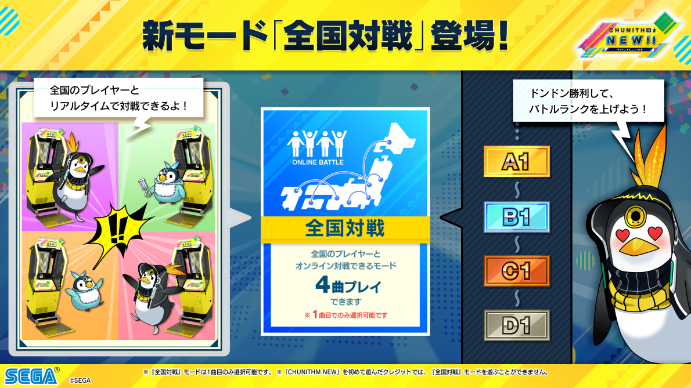

Winning in online battle results in your "Battle Rank" increasing, which is shown on your nameplate and can also impact other cosmetic items like titles. Online Battle is only implemented in the JP server.

## Unlock Challenge

VERSE: Unlock Challenges are a form of task track where players must clear charts while maintaining a limited lifebar. As soon as the lifebar falls to zero, the attempt immediately ends and the player is sent to the score screen. Clearing the unlock challenge unlocks the chart for normal play.

Non-justice-critical judgements will all decrease the lifebar by varying amounts, and the clear requirements are relaxed at various points in time after the unlock challenge is introduced.

| Judgement        | Penalty  |
| ---------------- | -------- |
| Justice          | -1 life  |
| Attack           | -2 life  |
| Miss             | -5 life  |

The lifebar starts at 10 life, then proceeds to 50 life and finally 150 life.

By default, an unlock challenge can only be attempted once per credit, and additional tries can be given by using various tickets.

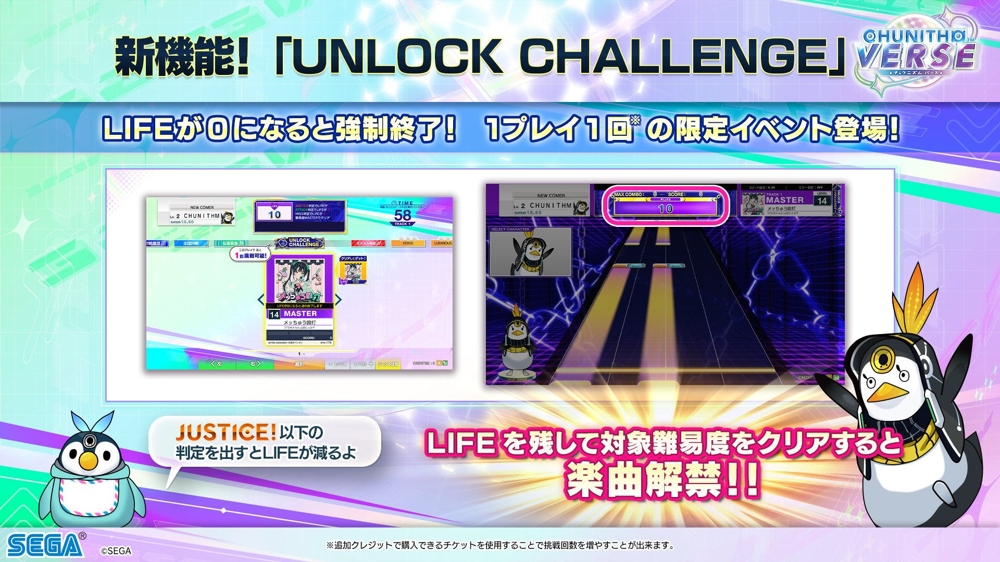

More info can be found on the [jp wikiwiki](https://wikiwiki.jp/chunithmwiki/UNLOCK%20CHALLENGE).

## Linked VERSE

X-VERSE: Linked VERSE is Chunithm's special 10 year anniversary "throwback" system present in X-VERSE and X-VERSE-X. Mechanically, it introduces a hidden "sequel song" to a boss chart from each prior themed version of the game, and players must fulfill hidden unlock conditions followed by a challenge run to unlock these songs.

Upon completion of the version named maps (ep. ORIGIN/AIR/STAR etc.), a Gate will appear in the Linked VERSE folder. Players must also complete hidden objectives to receive an Access Card, which will then allow players to attempt to unlock the attached song.

For details on unlock conditions and tips to optimize unlocking Linked VERSE, check out the [Chunithm Linked VERSE Unlock Guide spreadsheet](https://docs.google.com/spreadsheets/d/1j7kmCR0-R5W3uivwkw-6A_eUCXttnJLnkTO0Qf7dya0/edit?usp=sharing)!

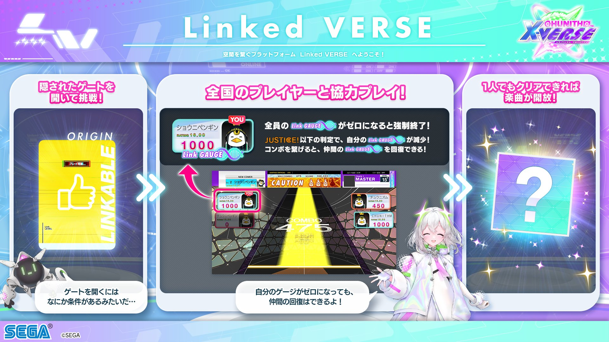

More info can be found on the [jp wikiwiki](https://wikiwiki.jp/chunithmwiki/Linked%20VERSE).

# Overpower and Possession

## Overpower

Overpower (OP) is an indicator that was introduced in Chunithm STAR PLUS, and it acts as a sort of "global completion marker" for the game. It is calculated from the best score on each chart compared to the theoretical maximum.

The Overpower indicator can be toggled in **settings**.

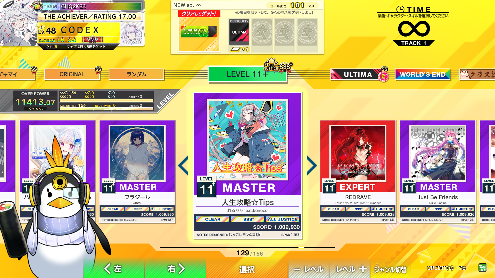

The way that overpower is determined is not relevant for most players, but it does have some involvement with the possession system (see below). Generally speaking, you need to try and get as many charts as close to their theoretical maximum value (All Justice Critical) as possible to reach maximum overpower.

Overpower scales primarily based on the chart constant, but most OP gain is held **beyond the SSS score threshold**. About 5-6% of OP on a given chart will remain in the 2500 points beyond SSS, which itself only accounts for 0.3% of the total score. Additionally, combo frames contribute an extremely significant amount of overpower, detailed below:

- Full Combo = +0.5 OP
- All Justice = +1.0 OP
- All Justice Critical = +1.25 OP

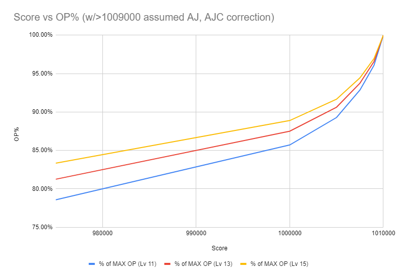

A table detailing benchmark scores required to reach Possession thresholds across a sampling of difficulties is shown below.

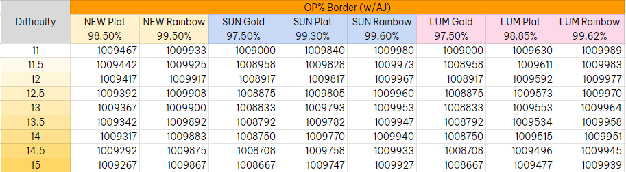

### Overpower Calculation/Display (~LUMINOUS)

The Overpower tracking system was overhauled in accordance with the Ultima system changes made to this version. Pre-LUMINOUS+, overpower was calculated for every **individual chart**, and the player would have been able to see their Overpower metrics for whatever folder and difficulty was active at the time. For instance, a score on an Expert chart would contribute to Expert OP% but would not contribute to possession (which only considered Master OP and Ultima OP).

Note how the Overpower value displayed is different between Expert difficulty and Master difficulty.

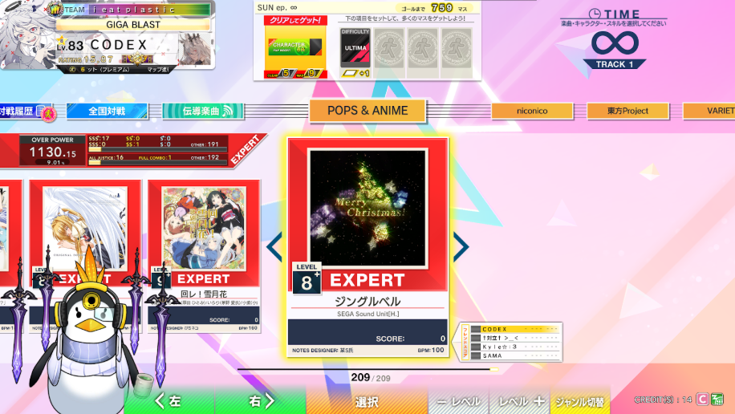
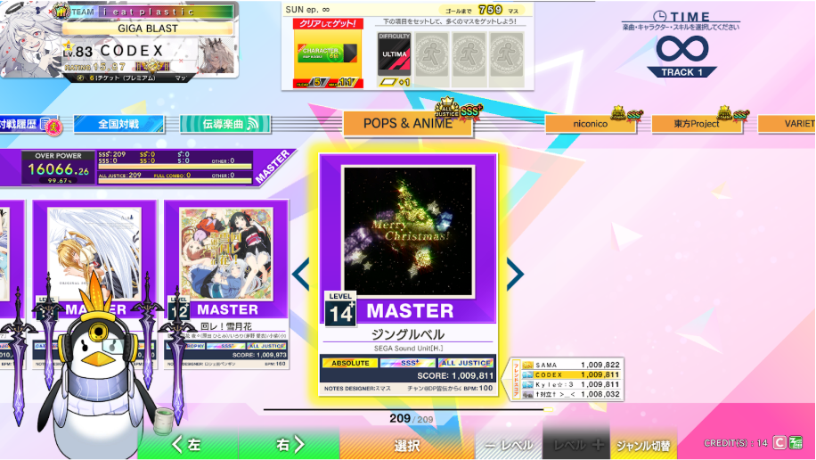

### Overpower Calculation/Display (LUMINOUS+~)

Overpower metrics are now calculated for the **song**, regardless of the difficulty. For each song, the score that would result in the **highest OP** value contributes to Total OP. This is typically the score on the highest played difficulty, but in some instances a very high score on a lower difficulty chart may provide more OP than a poor score on a higher difficulty chart.

The Total OP is now calculated from the theoretical value (AJC) on the highest available difficulty across all songs in the folder.

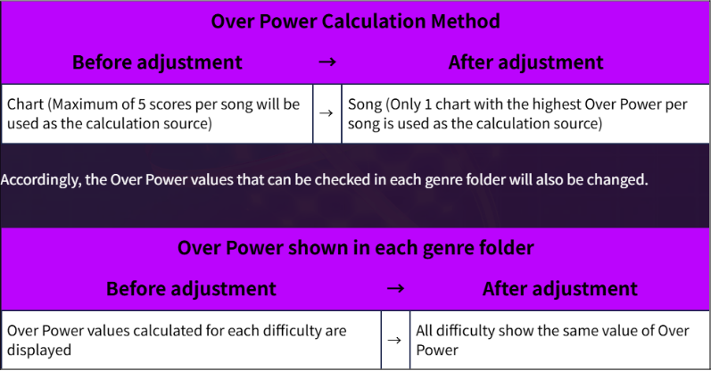

Folders will likewise display the **Total OP** gained on the folder instead of being bound by the difficulty. The two photos below show the same Overpower number and OP%, but different clear lamps.

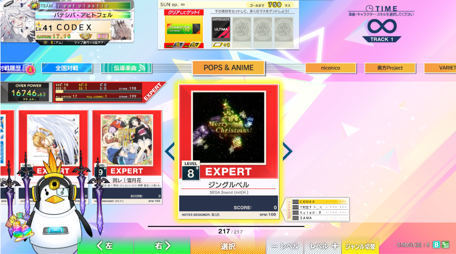
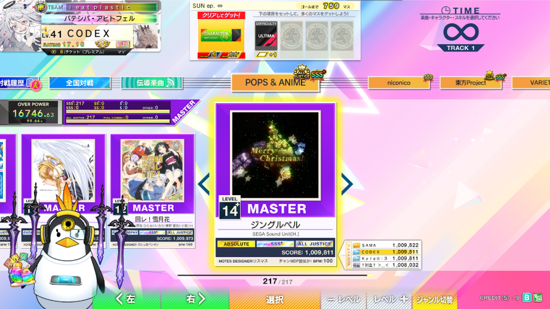

Additionally, the Random tab in song select will now display **Total OP and OP%**. The rank/combo lamps displayed in this view will change with the selected difficulty.

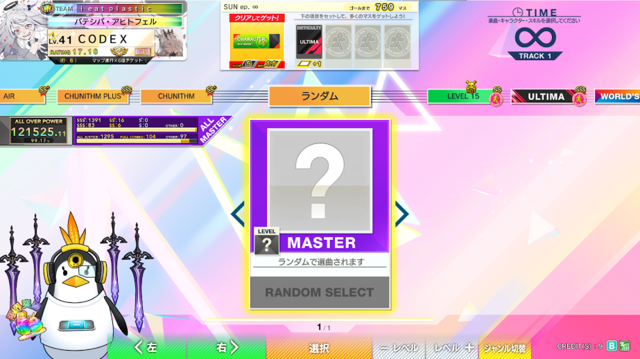

Details about overpower breakdown (including the calculation formula) can be found on [wikiwiki](https://wikiwiki.jp/chunithmwiki/%E3%83%AC%E3%83%BC%E3%83%86%E3%82%A3%E3%83%B3%E3%82%B0%E3%83%BBOVER%20POWER).

## Possession

Rating possession is an indicator that was introduced in Chunithm AMAZON PLUS. Achieving a rating possession will change the portion of the player card that includes the player tag, level, rating, and class badge/banner to have a silver, gold, platinum, or rainbow background depending on specific requirements. These requirements include achieving a **minimum rank** on **all Master charts** (and Ultima charts in New and above) **in the entire game**.

| Possession Type | Player Card                                                                     |
| :-------------- | :------------------------------------------------------------------------------ |
| Silver          | 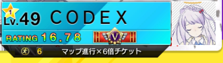{: style="width: 300px"}   |
| Gold            | 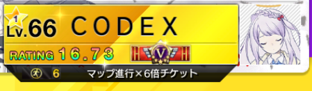{: style="width: 300px"}       |
| Platinum        | 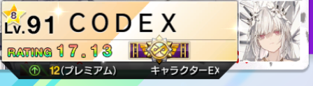{: style="width: 300px"}   |
| Rainbow         | 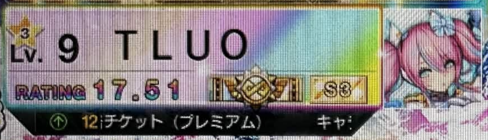{: style="width: 300px"} |

The conditions for achieving rating possession are as follows:

| AMAZON+~CRYSTAL |                |              |                 |
| --------------- | :------------: | :----------: | :-------------: |
| **Colour**      |   **Rating**   |   **Rank**   | **OP required** |
| Silver          | 15.25 or above |  S or above  |       N/A       |
| Gold            | 15.50 or above | SS or above  |       N/A       |
| **Rainbow**     | 15.75 or above | SS or above  |      99.5%      |

| CRYSTAL+~PARADISE LOST |                |             |                 |
| ---------------------- | :------------: | :---------: | :-------------: |
| **Colour**             |   **Rating**   |   **Rank**  | **OP required** |
| Silver                 | 15.25 or above |  S or above |       N/A       |
| Gold                   | 15.50 or above | SS or above |       N/A       |
| Platinum               | 15.50 or above | SS or above |      98.5%      |
| **Rainbow**            | 15.75 or above | SS or above |      99.5%      |

| NEW~NEW+    |                 |             |                 |
| ----------- | :-------------: | :---------: | :-------------: |
| **Colour**  |   **Rating**    |   **Rank**  | **OP required** |
| Silver      | 16.25 or above  |  S or above |       N/A       |
| Gold        | 16.50 or above  | SS or above |       N/A       |
| Platinum    | 16.50 or above  | SS or above |      98.5%      |
| **Rainbow** | 16.75 or above  | SS or above |      99.5%      |

| SUN~SUN+    |                    |              |                 |
| ----------- | :----------------: | :----------: | :-------------: |
| **Colour**  |   **Rating**       |   **Rank**   | **OP required** |
| Silver      | 16.25 or above     |   S or above |       N/A       |
| Gold        | 16.50 or above     |  S+ or above |      97.5%      |
| Platinum    | 16.**75** or above | SS or above  |    **99.3**%    |
| **Rainbow** | 16.75 or above     | SS+ or above |    99.**6**%    |

| LUMINOUS    |                    |              |                 |
| ----------- | :----------------: | :-------- -: | :-------------: |
| **Colour**  |   **Rating**       |   **Rank**   | **OP required** |
| Silver      | 16.25 or above     |   S or above |       N/A       |
| Gold        | 16.50 or above     |  S+ or above |      97.5%      |
| Platinum    | 16.75 or above     | SS or above  |   **98.85**%    |
| **Rainbow** | **17.00** or above | SS+ or above |   99.6**2**%    |

| LUMINOUS+   |                |                  |                 |
| ----------- | :------------: | :--------------: | :-------------: |
| **Colour**  |   **Rating**   |     **Rank**     | **OP required** |
| Silver      | 16.25 or above |     S or above   |       N/A       |
| Gold        | 16.50 or above |    S+ or above   |      97.5%      |
| Platinum    | 16.75 or above |   SS or above    |   **99.00**%    |
| **Rainbow** | 17.00 or above | **SSS** or above |   99\.**50**%   |

| VERSE~X-VERSE |                    |              |                 |
| ------------- | :----------------: | :----------: | :-------------: |
| **Colour**    |     **Rating**     |   **Rank**   | **OP required** |
| Silver        | **16.00** or above |   S or above |       N/A       |
| Gold          | **16.00** or above |  S+ or above |      97.5%      |
| Platinum      | **16.00** or above | SS or above  |     99.00%      |
| **Rainbow**   | **16.00** or above | SSS or above |     99.50%      |

_Credit to beerpsi for finding accurate possession thresholds and values_

If you see anyone with a possession plate, you can tell that they've sunk a lot of time into the game. I encourage players who are passionate about Chunithm to go for at least Silver possession—the experience of playing through all of the different patterns in the game is helpful for solidifying fundamentals.
Ddrlevelasian’s [CHUNITHM Possession Guide](https://docs.google.com/document/d/1wCRvaoXezTfqFLwY9bssxgWifvOHXJC6jt_mi0QrutQ/edit?usp=sharing) is a fantastic read if you are at all curious about what the process of possession is like and how it can benefit you as a player.
