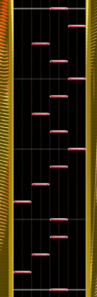
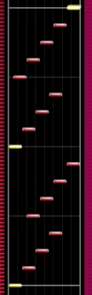

# Skill Areas and Terminology

Chunithm is a game with a lot of depth that demands a wide range of different player skills across its many charts. This is one of my favourite parts of the game as the skill expression at higher levels can be wildly different among different players. With that said, I have identified a few broad skill areas that I believe are helpful to understand and distinguish between going forward as we delve further into technique and chart-specific analysis. Knowing these terms will help you go through the **Chunithm Chart Codex** ([current version](https://docs.google.com/spreadsheets/d/1xP1huTSA-XWKZaDfmyNh-viRbUE777d2Rg54j5-2VAU/edit?usp=sharing)) as they are used liberally throughout.

## Fundamental Skill / "Earth Power"

From iidx.org, Earth Power is defined as "\[the\] measure of your base ability to read and hit notes". This includes your ability to time notes, and respond to basic patterns like [jacks](https://iidx.org/terminology#jacks) and [trills](https://iidx.org/terminology#trills). For example, if I describe a chart as "earth power heavy", that just means that a typical player should be able to sightread or understand the chart without too much trouble as it probably has mostly basic patterns.

As an aside, the term "Earth Power" is a literal translation of 地力 that is used in the BMS community.

## 4K/Mania

4K is an abbreviation of "4 keys", which is a direct description of how note patterns are arranged. The play field is split up into 4 equally sized lanes and thus you hit patterns just like you would in other games like **Sound Voltex** or **Osu!Mania**, etc.

{: style="width: 150px"}

## Keyboarding

Keyboarding is the ability to use individual fingers or sets of fingers to hit note patterns that move horizontally in a way that does not conform to 4 or 8 columns and generally makes you move your wrists. Similar concepts that are related to this skillset are the ability to hit rolls (see below), small width notes, or using additional fingers to hit [stairs](https://iidx.org/terminology#stairs) with 5 or more notes.

{: style="width: 150px"}

## Speed

Speed is the physical ability to hit note patterns that are just really fast. Some patterns might be conceptually straightforward, like trills, but when the game wants you to hit a 16th-note trill at 200+ bpm that might be a different story. **Speed control** is also a key aspect of this skill, as being able to maintain a fast yet consistent rhythm is important for a lot of high level charts and the game will punish you for rushing.

## Stamina

Stamina is the ability to maintain energy to efficiently move your hands and arms throughout the runtime of a chart. Generally, this isn't a skill that comes up that often as all Chunithm charts are charted to a duration of roughly 2 minutes, but some charts (e.g. _BATTLE NO.1_, _Volcanic_) throw in a lot of arm movement that makes it tougher to maintain timing as the song progresses.

## Tech/Technical

Technical skill is the most broad category of player skill, and encompasses everything not covered by the other skill categories (analogous to [individual difference](https://iidx.org/terminology#individual-difference) in iidx). This includes the ability to hit patterns that are unique to Chunithm, such as crosshanding, overlapping notes, tap slides, jumping over middle hold/middle trills, simultaneous holds and inner/outer trills, and more. These patterns are explained in the next section.
