# Hand/Finger Techniques

## Standard Fingering

Since the basis for many patterns in Chunithm is 4k, it is important to have a strong "default" fingering layout to hit notes. Using individual fingers to hit basic note patterns is highly advised, as at higher difficulties the speed at which the charts throw patterns at you make it very difficult to accurately hit using only your whole hand.

Following standard piano finger notation (1 are thumbs, 5 is pinky, and they increase from the center outward), the main recommended fingering is as follows:

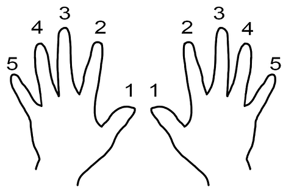

**4-2-2-4** (LH ring finger \- LH index finger \- RH index finger \- RH ring finger)
This fingering is generally the most common one that I see players with experience playing other 4k games defaulting to, myself included (this is exactly the same position as **SDVX**).

This fingering does not have to be obeyed at all times, and players can use whatever they feel comfortable with. 3-2-2-3 is not generally recommended as there is less separation between the index and middle fingers, making it easier to miss patterns, except for long sections of small notes (e.g. Alma MAS). 5-2-2-5 is a viable alternative, as well as most other fingering positions that are symmetrical.

As you begin to play Master charts at higher difficulty, you should start to build **flexibility** in your fingering as you adapt to non-standard chart patterns.

Developing the habit of hitting tap notes with individual fingers is key to reducing **splashing** (hitting/triggering unintended notes, usually in the form of attacks).

## Crosshanding

Crossover/crosshand patterns appear in **many** different ways in Chunithm, and is one of the **primary gimmicks** in the game for Expert and Master difficulty charts. Generally speaking, they consist of one hand hitting a **slide note**, which makes that hand move from its original position, and the remaining hand must reach over to hit notes on the other side. The way to improve at these is really just to play Chunithm more; you will begin to understand when the game is asking you to crosshand.

One mental shorthand you can use to predict whether a pattern is supposed to be crossed over is if the slide note has a **sharp curve** instead of being completely straight, although zig-zag slides are also common. Shown below are a few samples of crosshand patterns:

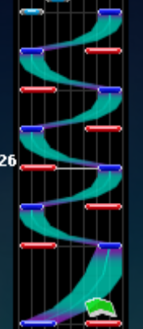{: style="width: 100px"}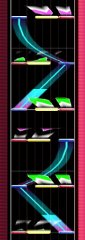{: style="width: 100px"}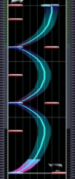{: style="width: 100px"}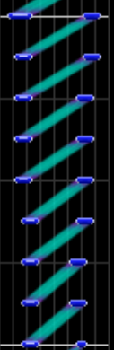{: style="width: 100px"}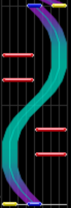{: style="width: 100px"}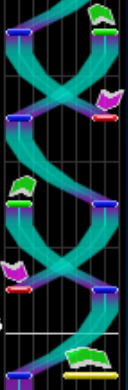{: style="width: 100px"}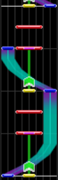{: style="width: 100px"}
 
*And that's just the tip of the iceberg, almost all charts past Expert difficulty have some form of crosshanding*

## Widehanding

Widehanding is a strategy you can use to hit chords and small notes. This can greatly simplify lower difficulty charts, and is pretty much required in higher difficulty charts. Essentially, you spread out your fingers to cover a wider area than the center note, and it should trigger the notes on either side (in the case of a chord) or avoid missing (in the case of small notes). Be careful not to accidentally trigger notes that might not yet be at the judgement line that might be next to the note you're trying to widehand.

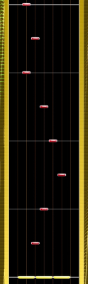{: style="width: 100px"}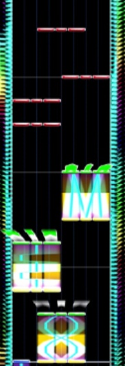{: style="width: 100px"}
 
Appears in: *Vallista*, *8-EM*, etc.

## Zenoshi

Zenoshi (JP: 全押し \- translates to "full press") refers to pressing the entire ground slider to hit patterns that span the entire field, such as below. At higher speeds, they can be considered (zenoshi) jacks.

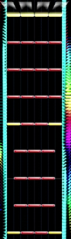{: style="width: 100px"}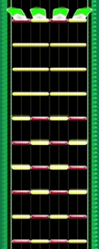{: style="width: 100px"}
 
Appears in: *Wheel to the right \[EXP\]*, *GERBERA*, etc.

## Trills/Drills

Trills are a common pattern in many rhythm games where you alternate between two notes at a fixed timing interval, usually 8ths or 16th. Anything faster than that is typically considered a "burst" pattern (e.g. 24ths, 32nds) if they are short and a sustained fast trill over a long period of time is considered a drill (e.g. *Blackmagik Blazing*). There are also **split trills**, where one hand performs a trill while the other hand hits a different pattern

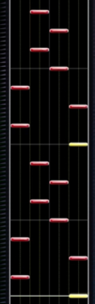{: style="width: 100px"}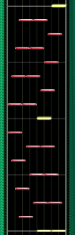{: style="width: 100px"}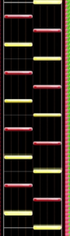{: style="width: 100px"}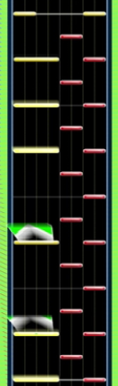{: style="width: 100px"}
 
Appears in: *End Time*, *Blackmagik Blazing*, *A Site de la Rue*, etc.

## Tateren

Tateren (JP: 縦連 \- loosely translates to "vertical string") refers to a technique where you alternate your hands to hit patterns, kind of like a trill. This applies in two ways:

Tap "trains" are composed of a column of tap notes that approach at a consistent speed. Generally, there are enough notes that it is not possible to hit the notes as a jack. Instead, you can consider the pattern to be a trill instead and alternate hands to hit the pattern while maintaining timing.

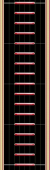{: style="width: 100px"}{: style="width: 100px"}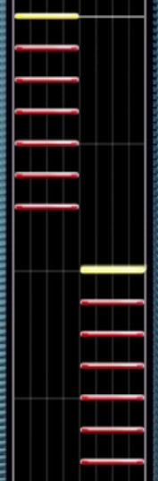{: style="width: 100px"}
 
*Peak charting design right here.*
 
Appears in: *今ぞ♡崇め奉れ☆オマエらよ！！ ～姫の秘メタル渇望～* , *ＧＯ！ＧＯ！ラブリズム♥*, *Grevious Lady, Black Lotus*, etc.

## Anmitsu

Anmitsu (JP: あんみつ/餡蜜 - translates directly to ‘bean paste' from Japanese) refers to a technique where you simplify patterns by taking advantage of the timing windows and "chunking" them. One way to apply this is to target notes that are nearby in timing and pressing them at the same time instead of individually, and is a strategy that people use to tech very difficult or dense trills or rolls. Practically, you want to aim for the timing in between adjacent notes, and treating them like chords or applying widehanding/zenoshi.

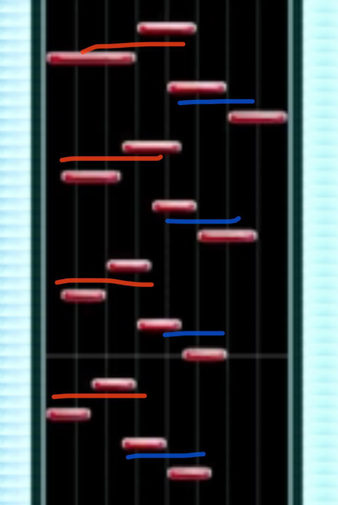{: style="width: 100px"}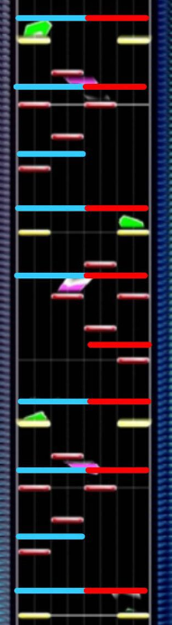{: style="width: 100px"}
 
E.g. *もぺもぺ*,  *AttraqtiA*, etc.

As an aside, the name of the technique comes from a beatmania 5k player who employed this technique (source from [iidx.org](https://iidx.org/terminology#anmitsu)).

## Rolls

Simply put, rolls are just fast stairs. They tend to go in the same direction but don't necessarily have to.

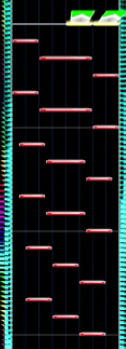{: style="width: 100px"}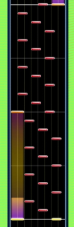{: style="width: 100px"}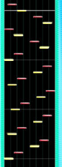{: style="width: 100px"}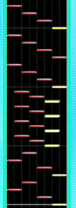{: style="width: 100px"}
 
*Did I really use two screenshots from Dengeki Tube? Yes I did.*
 
Appears in: *8-EM*, *A Man in the Mirror*, *Dengeki Tube*, etc.

## Tap/Flick Slides

Tap slides are a bunch of small tap notes that are arranged in a staircase, but the note widths are much smaller than a typical stair pattern. The way you are intended to hit these is to simply hold down the slider and drag your hand in the direction of the tap slide as it hits the judgement line. While fun, these are very easy to hit too quickly/too slowly and are common choking hazards for players. These can also be composed of flick notes, and are then referred to as flick slides.

An additional piece of advice for hitting flick slides: use a **wide** hand and spread your fingers apart like a claw, you can increase the change of triggering flicks by **maximizing** slider contact. This technique is also helpful for triggering many flicks in a row in charts like 神威 or 宛城、炎上！！

However, for **thin** tap slides (like those shown below), you want to **minimize** slider contact to avoid triggering unintended tap notes (i.e. "splashing"). Consider using only a few fingers.

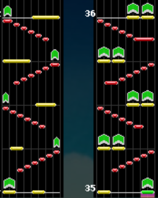{: style="width: 200px"}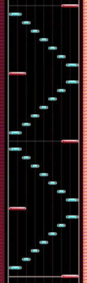{: style="width: 100px"}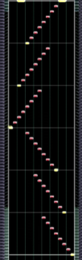{: style="width: 100px"}
 
Appears in: *Solstånd*, *Destr0yer*, *玩具狂奏曲 \-終焉-*, etc.

## Anchor Holds / "Constrained" Patterns

A common pattern around the expert and master range involves having to hit notes adjacent to a hold or slide with the hand that is occupied with that hold. This type of pattern is referred to as **kousoku** (JP: 拘束) in Japanese, roughly translating to restricted or constrained.

This type of pattern ranges from simply tapping a note right next to the hold at a basic level to quickly hitting notes on both sides of a hold with one hand, and many patterns in the game fall under this description.

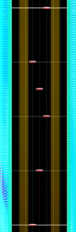{: style="width: 100px"}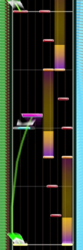{: style="width: 100px"}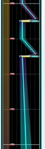{: style="width: 100px"}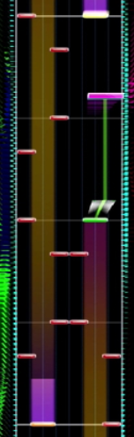{: style="width: 100px"}
 
Appears in: *凛として咲く花の如く*, *Sunlight Starlight, Super Ambulance*, *Schrecklicher Aufstand*, and many many others.

One particular variant of this pattern is the **"constrained trill"** (JP: 拘束トリル), where both hands are occupied with hold/slide notes and must perform a trill across/in between/outside the holds.

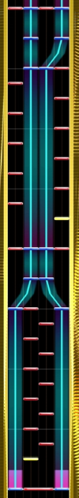{: style="width: 100px"}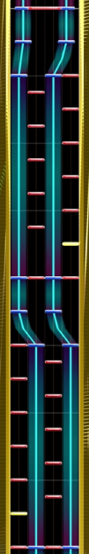{: style="width: 100px"}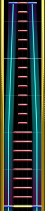{: style="width: 100px"}{: style="width: 100px"}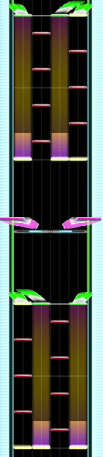{: style="width: 100px"}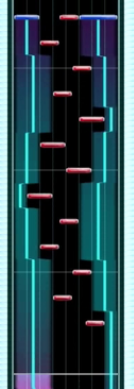{: style="width: 100px"}
 
Appears in: *ギガンティックO.T.N*, セイクリッド ルイン,*「四季」より「冬」*, *LAMIA*, etc.
